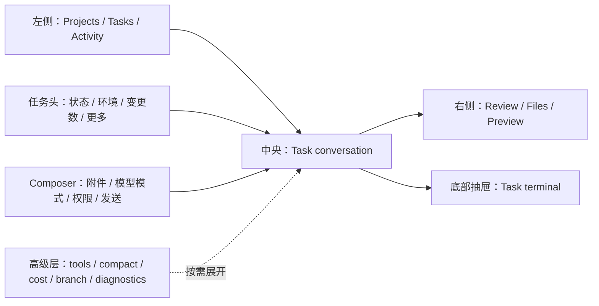

# Codex 与 Pi GUI 页面及体验差异报告

> 评估日期：2026-07-31
>
> Pi GUI 基线：本仓库 2026-07-31 的本地工作区快照
>
> Codex 基线：本机桌面端 `26.727.4816.0`，结合 2026-07-30 前后的 OpenAI 官方产品文档
>
> 报告目标：判断哪一套体验更好，明确 Pi GUI 应保留、重构、对齐和暂缓的体验，并给出可实施路线。

## 1. 执行摘要

### 1.1 最终判断

如果以“第一次打开就知道下一步、能并行管理长任务、能安全完成代码审查与交付”为标准，**Codex 的默认产品体验更好**。

如果以“多 Provider 控制、运行细节透明、本地文件与会话操作、长对话导航”为标准，**Pi GUI 当前页面把这些专家能力暴露得更直接**。这是本次走查可确认的差异化，不等于 Codex 整体专业能力较弱。

最合适的方向不是复制 Codex 的视觉，而是：

> **用 Codex 的任务中心外壳，承载 Pi 的专家级内核。**

也就是：

- 对齐 Codex 的任务信息架构、状态语言、Review 闭环、权限表达、渐进披露和安全反馈。
- 保留 Pi 的多模型、推理与工具控制、Steer / Follow-up、会话内分支、文件引用、长会话 minimap、成本与上下文统计等优势。
- 把 Pi 的高级能力从“全部常驻第一层”调整为“默认路径简洁、需要时逐层展开”。

### 1.2 一页决策

| 决策 | 体验 | 结论 |
|---|---|---|
| 必须保留 | 多 Provider / 模型、推理等级、工具预设、成本与上下文统计 | 这是 Pi 的核心差异化，但应收进高级层 |
| 必须保留 | Steer / Follow-up、队列召回、可靠的 SSE 重连与状态对账 | 已接近成熟 agent 工作台水平 |
| 必须保留 | 文件树、标签页、预览、Diff、精确行引用、worktree 聚合 | 比普通聊天产品强，不应为对齐而删除 |
| 必须保留 | 独立 Fork + 会话内 BranchNavigator | 保留为高级能力，主路径中减少曝光 |
| 必须对齐 | 项目 / 任务 / Activity 的一级导航 | Codex 更符合用户“管理任务”而不是“管理技术对象”的心智 |
| 必须对齐 | Needs input、Waiting approval、Failed、Completed 等任务状态 | 当前 Pi 的 running / unread 不足以监督后台任务 |
| 必须对齐 | Review / 交付：查看、逐行反馈、stage、revert，再完成 commit、push | Pi 目前的 Diff 更像查看器，还不是完整交付闭环 |
| 必须对齐 | 每任务终端、环境模式与权限边界 | 让执行、验证与安全控制留在同一上下文 |
| 必须重构 | 顶栏、左栏与 Composer 的控制密度 | 功能保留，层级重排 |
| 必须重构 | 原始工具卡、JSON、TPS、usage 的默认展示 | 默认改成人类可读活动摘要，诊断信息保留在第二层 |
| 必须重构 | 删除、错误、弹窗、焦点、键盘和移动触控 | 属于基础质量，不是可选优化 |
| 暂缓 | Cloud、自动化、PR 深度集成、多仓库 Review | 等本地任务闭环成熟后再做 |
| 不应复制 | Codex 的具体皮肤、术语和 Git-only 假设 | 对齐任务模型，不做像素级仿制 |

## 2. 评估方法与边界

本报告使用三类证据交叉验证：

1. **实际走查 Pi GUI**
   - 桌面视口：1280 × 720。
   - 移动视口：390 × 844。
   - 实际打开现有会话、展开 Process details、查看 69 个变更、打开文件标签页与 Diff、检查分支入口和主题菜单。

2. **Pi GUI 代码审阅**
   - 覆盖 `AppShell`、`SessionSidebar`、`ChatWindow`、`ChatInput`、`MessageView`、`FileExplorer`、`FileViewer`、`TabBar`、`BranchNavigator`、`useAgentSession` 等核心路径。
   - 同时审阅响应式、键盘、焦点、ARIA、错误恢复和颜色对比。

3. **当前 Codex 官方能力基准**
   - 使用本机安装版本信息与 OpenAI 当前官方文档。
   - Codex 桌面端没有通过自动化工具直接操控，因此本报告重点比较信息架构和公开交互能力，不做像素、动画时长或精确尺寸判断。

需要特别纠正一个过时判断：**当前 Codex 并不是“单栏聊天、没有文件面板”**。OpenAI 当前把它定位成项目级 agent 工作台，核心结构包括项目与聊天、活动任务、Review/Diff、每聊天终端、worktree、权限、Goal 和 subagent 等能力。

## 3. 两者的核心产品模型

### 3.1 Codex：围绕“任务交付”组织

Codex 的默认心智模型是：

```text
Project
  └─ Chat / Task
      ├─ Agent activity and status
      ├─ Review / Diff
      ├─ Terminal validation
      ├─ Local / Worktree / Cloud environment
      └─ Commit / Push / PR handoff
```

它的优势不只是页面简洁，而是把“提出任务—执行—验证—审查—交付”放进同一个任务上下文。

### 3.2 Pi GUI：围绕“Agent 会话与能力控制”组织

Pi GUI 当前的心智模型更接近：

```text
Project
  ├─ Worktree
  ├─ Session tree
  ├─ Files / Changes / Upload
  ├─ Models / Skills / Plugins
  └─ Chat
      ├─ Tool process
      ├─ Fork / in-session branch
      ├─ Model / reasoning / tools / compact
      └─ File viewer / preview / diff
```

它更像 Pi TUI 的可视化控制台：能力密度高、底层状态透明，但用户要先理解 session、fork、branch、tools、compact、context 等技术概念。

### 3.3 核心差别

Codex 优先回答：**“这个任务现在到哪一步，我下一步该做什么？”**

Pi GUI 优先回答：**“这个 Agent 当前以什么配置、在什么会话和文件上下文中运行？”**

对专业用户，两者都重要；但默认入口应先回答前一个问题。

## 4. 页面信息架构差异

| 区域 | Codex 当前范式 | Pi GUI 当前实现 | 判断 |
|---|---|---|---|
| 左侧导航 | Projects、Chats、Activity、待处理状态 | 项目、worktree、session、文件、Changes、上传、Models、Skills、Plugins | Pi 功能更多；Codex 层级更清楚 |
| 中央主区 | 当前任务、运行状态、对话和结果 | 对话、Process details、分支、系统提示与统计 | Pi 透明度高；Codex 更任务化 |
| 右侧上下文 | Review 为一等公民，围绕 Git 变更行动 | 多标签文件查看器，可 Source / Preview / Diff | Pi 是强查看器；Codex 是审查与交付面板 |
| 底部上下文 | 每聊天独立终端 | 无等价的一等终端面板 | Codex 明显更完整 |
| Composer | 模型、推理、环境、权限、附件、技能；运行时 Steer / Queue | 模型、推理、tools、compact、sound、附件；运行时 Steer / Follow-up | 能力接近，Codex 的概念分组更好 |
| 任务状态 | Activity / require attention，以及公开的 Running、Needs input、Ready、Blocked | Running、completed-unread、普通 | Codex 当前的任务监督语言更完整；Approval、Failed 等属于本报告给 Pi 的扩展建议 |
| 会话管理 | 搜索、Pin、Archive、分支来源、项目分组 | Rename、Delete、树状关系 | Codex 更安全、更易管理 |
| 环境 | Local / Worktree / Cloud，支持 Handoff | cwd / worktree，技术实现强但产品表达分散 | 应先对齐 Local / Worktree 表达 |
| 权限 | Sandbox 与 approval policy 分开表达 | Project Trust、tool preset 等概念分散 | Codex 心智更清楚 |
| 移动与窄屏 | 官方资料体现渐进披露原则；本报告未直接实测 Codex 移动端 | 已有抽屉与全屏文件面板，但顶栏仍很密 | Pi 响应式基础好；可借鉴该原则，但不把它视为实测领先 |

## 5. 哪个更好：分维度判断

### 5.1 Codex 明显更好的部分

#### A. 任务启动与多任务监督

Codex 把 Project、Chat、Activity 和需要注意的状态放在一级导航中。当前公开资料明确展示 Activity / require attention，以及 Running、Needs input、Ready、Blocked 等状态；不能据此推断所有审批或失败类型都已成为侧栏一级状态。

Pi GUI 已有 running 和 completed-unread，说明基础事件能力存在，但当前状态词汇太少。长任务一旦卡在扩展对话、审批或失败状态，用户必须进入会话才能理解发生了什么。

**结论：对齐 Codex。**

#### B. 变更审查与交付闭环

Codex Review 面板不是单纯 Diff：它能按 Unstaged、Staged、Commit、Branch、Last turn 等范围查看整个仓库状态，支持逐行反馈，以及按整体 diff、文件或 hunk 执行 stage / unstage / revert；在同一桌面应用工作流中还可以继续 commit / push。

Pi GUI 已经有 Changes 数量、变更文件列表、统一 Diff 和工具调用中的 split diff，基础不弱；但目前主要是“看”，缺少“审、改、接受、撤销、交付”。而且两套 Diff 视觉与交互并不一致。

**结论：这是最大能力差距之一；P0 先统一 Diff 与安全回退，完整交付闭环在 P1 完成。**

#### C. 终端验证

Codex 每个 chat 有与 project / worktree 绑定的终端，用户能运行测试、查看服务，Agent 也能读取当前终端输出。

Pi GUI 已有用户可见的一次性命令通道：在 Composer 中输入 `!` / `!!` 可执行 shell，并选择把输出送入模型或只保留在本地；Agent 也能调用 shell。真正缺少的是可持续的 PTY、任务级终端历史、断线恢复和进程管理，因此“Agent 说已经验证”和“用户持续观察验证过程”仍然割裂。

**结论：应对齐，但放在 Review 基础之后。**

#### D. 权限和执行环境的产品表达

Codex 将 Local / Worktree / Cloud 与 Ask / Approve / Full / Custom 等安全边界放在任务启动路径附近。

Pi GUI 的 Project Trust、工具预设和实际工具权限是不同概念，但页面上容易混为一谈。用户可能知道“启用了 full tools”，却不清楚文件、网络和命令到底能做什么、何时需要确认。

**结论：对齐概念模型，不必复制命名。**

#### E. 渐进披露

Pi GUI 顶栏长期暴露主题、语言、信任、历史、自动命名、分支、系统提示、token、cost、context、文件面板等入口；Composer 又常驻模型、推理、tools、compact、sound。

这些功能大多有价值，问题是全部处于同一视觉优先级。Codex 更接近“先完成任务，再按需展开配置”。

**结论：对齐层级，保留能力。**

### 5.2 Pi GUI 已验证、应保留的差异化能力

#### A. 多模型与专业控制

Pi GUI 的 Provider、模型、thinking level、tool preset、compact、token / cache / cost / context 透明度很高。对于自托管、多 Provider、成本敏感和调试型用户，这种把控制与诊断直接放在 UI 中的方式有明确价值。Codex 同样支持模型与推理配置及多种运行配置，因此这里比较的是 Pi 的“可见性与直接性”，不是断言 Codex 只有单一路径。

**保留方式：** 默认只显示当前模型、模式和异常 badge；其余进入“高级运行配置”和“诊断详情”。

#### B. 长会话体验

Pi GUI 已实现历史分页、加载历史时保持滚动位置、用户上滚后不强制吸底，以及按轮次、Assistant 消息和标题跳转的 minimap。

这套能力对于几十轮甚至上百轮 agent 会话非常有价值，是值得保留的产品差异化。

#### C. 会话分支能力

Pi 同时拥有：

- Fork：生成独立 session 文件。
- In-session branch：在同一个会话文件内切换叶子上下文。

Codex 官方资料明确支持从旧消息 fork 到新 chat，但没有明确展示一套常驻的会话内分支树。Pi 的 BranchNavigator 因此可以保留为高级用户能力。

**重构方式：** 默认只显示“从此处分叉”；完整 BranchNavigator 放进任务历史或高级菜单，避免两种分支概念同时占据主界面。

#### D. 本地文件上下文的透明度

Pi 文件区不仅服务于 Git 变更，还支持持久的本地文件树、多标签、精确行引用，以及 Markdown / HTML / PDF / DOCX / 图片 / 音频预览。Codex 当前也支持文档、表格、演示、PDF、HTML 等 artifacts 的预览、批注与修改，因此 Pi 的可靠差异点是“本地 File Explorer、多标签和精确行引用更直接透明”，而不是格式覆盖绝对更多。

**保留方式：** 右侧上下文面板使用 `Review / Files / Preview` 三个一级标签，不要用 Review 替换 File Explorer。

#### E. Agent 连续性与故障恢复

Pi 的 SSE 在 prompt 前建立，支持刷新中途重连、后台可见性与网络恢复对账、单调 run id 防止旧事件复活、发送失败撤销 optimistic bubble 并恢复草稿。

这是用户不一定能说出来、但直接决定信任感的底层优势。应完整保留。

#### F. Steer / Follow-up

Pi 已经能在运行中选择立即 Steer 或排队 Follow-up，并能把队列消息召回输入框。该能力与 Codex 的 Steer / Queue 范式接近，不需要重做核心，只需统一命名、状态与可编辑队列界面。

## 6. Pi GUI 的主要体验问题

### 6.1 P0：会阻碍核心任务或造成风险

#### 1. 信息架构过载

左栏同时承担项目、worktree、会话、文件、Git、上传和全局配置；顶栏也把大量低频控制常驻。结果是功能很全，但“新建任务—观察状态—审查结果”不突出。

实际在 1280px 宽度下同时打开左栏和右侧文件面板时，中间聊天区只剩约 450px，阅读和 Process 展开都明显拥挤。

#### 2. 缺少多轴任务状态模型

不应把 session 生命周期、单次 run 阶段和 attention 混成一个枚举。建议至少拆成：

- `lifecycle`：`active` / `archived`。
- `runtime`：`idle` / `running` / `compacting`；排队消息使用独立 `queueCount`，不伪装成 session 生命周期。
- `attention`：`none` / `needs_input` / `waiting_approval` / `failed` / `ready_unread`。

还要定义显示优先级、持久化和刷新恢复。例如 waiting approval / needs input 优先于普通 running badge，历史失败不能覆盖一场新的正常运行。当前 running API 主要只有 `runningSessionIds`，needs input / approval 也没有统一任务级后端来源，因此这不是只改侧栏即可完成的 UI 工作。

#### 3. 会话删除过于危险

当前会话主要只有 Rename 和 Delete，且 `Shift + Click` 可以跳过删除确认。对于可能包含大量上下文和分支的 session，这不是合理的默认安全模型。

应改为：

- 一级操作：Pin、Archive、Rename。
- Archive 后提供 Undo。
- 永久删除放到二级危险区，并始终二次确认。
- 不保留隐藏的快捷永久删除。

#### 4. 用户触发的异步失败不总是可见

Fork、Steer、Follow-up、模型切换等部分失败路径只写入 console。用户会误以为动作成功。

应建立统一 Action feedback：pending、success、error、retry；失败必须可见、可复制详情、尽量可重试。

#### 5. 核心交互不满足键盘和读屏使用

会话行、文件节点、Git 变更、分支树和文件 tab 大量使用可点击 `div`。隐藏面板仍可能进入 Tab 顺序；多个模态框缺少焦点圈定（focus trap）、初始焦点和关闭后的焦点返回；部分控件也缺少可见的 `:focus-visible` 样式。Theme menu 已正确拦截 Escape，但其他 top panel / dialog 缺少统一 overlay 优先级时，用户试图关闭弹层仍可能触发全局“停止 Agent”。

这不是“锦上添花”的可访问性问题，而是桌面工具的基本交互稳定性问题。

### 6.2 P1：显著降低理解和效率

#### 6. 实时 Process 偏调试器，不像任务进度

Pi 对已完成轮次的 Process details 默认折叠，thinking 和 tool JSON 也有各自折叠，这个方向是正确的。问题主要集中在实时 tail：原始 tool name、技术型工具卡和 TPS 会直接出现；完成消息页脚还常驻 usage / cost。这些信息对调试有价值，但不应和任务进度及用户结果争夺注意力。

建议默认活动语言为：

- “读取了 6 个文件”
- “修改了 2 个文件”
- “运行测试，1 项失败”
- “正在等待你的批准”

原始输入、模型性能和 token 统计放在“诊断详情”。

#### 7. 空状态缺少项目导向

新会话当前主要展示 Pi Web、版本和输入框。它没有明确告诉用户当前项目、运行环境、权限，也没有基于项目的启动动作。

建议提供 3–5 个动态 starter：

- 解释这个代码库
- 修复一个问题
- 审查当前改动
- 运行测试并处理失败
- 根据描述实现功能

#### 8. Files 与 Changes 关系不清楚

Changes 使用弱识别度图标，展开后和普通文件树相互替换；工具消息 Diff 与 FileViewer Diff 又是两套组件。

应统一为右侧 Context Panel：

- Review：任务与仓库变更。
- Files：通用文件导航。
- Preview：当前文件或产物。

统一 Diff renderer、行号、评论、复制、折叠和键盘行为。

#### 9. 错误恢复和状态通知偏弱

部分错误会替换现有内容、部分错误自动消失、部分没有 Retry，状态提示也缺少 `aria-live`。合理策略是保留最后一次成功内容，在顶部显示非阻塞错误，并提供 Retry / Copy details。

### 6.3 P2：基础质量与一致性

- 中文模式下 `<html lang>` 仍固定为英文。
- 多处残留硬编码英文。
- 10–11px 的 `--text-dim` 对主题背景的实测对比度约为：Light 2.71:1、Dark 3.60:1、Midnight / Forest 4.06:1，均低于普通文本 4.5:1。
- 移动端文件行和部分按钮只有 16–36px，低于建议触控尺寸；附件移除按钮还缺少可访问名称。
- Composer 未使用底部 safe area。
- `prefers-reduced-motion` 只覆盖少量动画。
- 用户上滚后没有明显的“有新输出 / 回到最新”按钮。
- 页面缺少清楚的 `header`、`nav`、`main`、`aside` landmark。

## 7. 目标信息架构

建议的桌面结构：



### 7.1 左栏：从资源树改成任务导航

一级固定入口：

1. New task
2. Search
3. Activity / Needs attention
4. Projects
5. Pinned tasks
6. Recent tasks

文件、Changes、Models、Skills、Plugins 不再共同占据左栏第一层：

- Files / Changes 进入右侧 Context Panel。
- Models / Skills / Plugins 进入 Settings 或项目设置。
- Worktree 作为任务的环境 badge 和项目二级结构，而不是默认首先理解的对象。

### 7.2 中间：明确“活动”和“结果”

每次运行分成两个视觉层：

- Activity：人类可读的进度、工具摘要、等待和错误。
- Final：Agent 的最终交付与下一步。

现有 Process details 折叠机制保留。展开后先显示可读活动，再提供 `Diagnostics` 查看原始 tool payload、TPS、usage 和 raw thinking。

### 7.3 右侧：Context Panel，不只是 File Viewer

建议标签：

- `Review`：全仓库 / Last turn / Staged / Unstaged / Commit / Branch。
- `Files`：通用文件树、搜索、上传与 `@mention`。
- `Preview`：文件标签、媒体与文档预览、精确行引用。

当当前任务产生变更时，自动展示 Changes badge，但不要强制抢走用户当前文件。

### 7.4 底部：每任务终端

终端应：

- 与当前 project / worktree 绑定。
- 在不同 task 之间隔离历史与进程。
- 支持 Agent 读取当前输出，但清楚提示读取范围。
- 支持 Collapse / Expand，不长期占用聊天宽度。

### 7.5 Composer：默认简洁，专业能力不丢

默认可见：

- Attach
- Model / Mode
- Permission
- Send / Stop

运行中：

- Steer
- Queue
- 队列条目编辑、排序、立即发送、删除

高级菜单：

- thinking level
- tool preset
- compact
- sound
- session diagnostics

任何非默认配置都以小 badge 回显，避免用户忘记当前处于特殊模式。

## 8. 响应式与可访问性目标

### 8.1 布局断点建议

| 宽度 | 建议行为 |
|---|---|
| ≥ 1440px | 左栏 + 中央 + 右侧三栏，可拖拽 |
| 1024–1439px | 中央保持至少约 640px；右侧使用覆盖层或与左栏互斥 |
| 768–1023px | 左栏抽屉；右侧全高 Context Panel；不同时常驻 |
| < 768px | 任务页单列；导航与 Context 全屏切换；低频顶栏操作进 overflow |

Pi 当前的桌面分栏、移动抽屉、全屏文件面板和键盘可调 resizer 应保留；重点修复焦点隔离、主区最小宽度和触控尺寸。

### 8.2 基础交互验收

- Task、File、Change、Branch、Tab 均可仅用键盘选择。
- 使用 `button`、`tree/treeitem`、`tablist/tab`、`listbox/option` 等正确语义。
- 关闭的侧栏与文件面板使用 `inert`、条件卸载，或同步移除后代焦点能力；`aria-hidden` 只能补充辅助技术隐藏，不能单独阻止 Tab 聚焦。
- 弹层有初始焦点、焦点圈定（focus trap）、Escape 关闭和焦点返回。
- 所有可交互控件都有清楚的 `:focus-visible` 样式。
- Escape 的优先级：关闭最上层弹层 → 退出局部模式 → 最后才是停止 Agent。
- Composer 的 slash、history、`@file` 和 model menu 使用完整 combobox / listbox 语义。
- hover-only 操作在 `:focus-within` 和触屏上可发现。
- 仅图标按钮提供 `aria-label` 或等价的可访问名称。
- 普通触控目标至少 40–44px。
- 错误使用 `role=alert`；短状态使用 `role=status`；流式正文不逐 token 播报。
- 支持 reduced motion，移动端底部使用 safe area。

## 9. 分阶段对齐路线

### P0：先修主路径与信任感

1. 建立 lifecycle / runtime / attention 多轴状态模型和 Activity / Needs attention 入口，并补齐服务端事件来源、持久化与刷新恢复。
2. 左栏任务化：Search、Pin、Archive、状态过滤；移除快捷永久删除。
3. 顶栏瘦身；保证 1280px 下聊天主区不被双侧栏挤压。
4. Composer 渐进披露；显式区分环境、权限和工具可用性。权限选择器只有在 Agent runtime 与 API 后端真实区分并强制执行 filesystem / network sandbox 与 approval policy 后才可对外承诺安全边界。
5. 建立统一错误反馈与 Retry。
6. 修复 Task / File / Tab / Dialog 的键盘、语义与焦点问题。
7. 先交付最小 Review：统一 Diff、区分 Last turn / Unstaged，并提供有确认与可恢复策略的安全 revert。
8. Process 默认改成人类可读活动摘要。

**P0 完成标准：**

- 用户无需进入任务即可识别 Running、Needs input、Waiting approval、Failed 和 Completed。
- 新用户能在 15 秒内确认项目、权限并开始任务。
- 任一用户触发操作失败都不会只留在 console。
- 1280px 宽度下中央阅读区不低于约 640px。
- 不使用鼠标也能完成任务切换、文件打开、tab 切换和消息发送。

### P1：补齐开发闭环

1. 将现有 Changes 与 FileViewer Diff 统一成 Review Panel。
2. 支持 Unstaged / Staged / Last turn 等 scope。
3. 支持逐行反馈、stage / unstage、revert。
4. 增加 commit / push；所有写操作受 allowed-root 约束，并处理 stale diff、dirty tree、确认、失败回滚与并发冲突。
5. 增加每任务终端，并允许 Agent 在授权范围内读取输出；实现 PTY 生命周期、断线重连、进程清理、Windows 支持和权限边界。
6. 提供“有新输出 / 回到最新”控件和可编辑 Queue。

**P1 完成标准：**

- 从 Agent 修改到用户审查、局部撤销、stage 和 commit，不需要离开 Pi GUI。
- 用户能区分“Agent 本轮修改”和“仓库原有修改”。
- 每个 task 的终端上下文与 worktree 一致，不串台。

### P2：强化并行 Agent 工作台

1. 将环境产品化为 Local / Worktree；实现两者间 Handoff。
2. 展示 subagent 子任务、状态、摘要和产物。
3. 加入 Goal / 长任务进度，可 pause、resume、edit、clear。
4. 增加命令面板、快捷键帮助和任务切换。
5. 完成移动端、国际化、对比度和 reduced-motion 收口。

### P3：条件成熟后再做

- Cloud environment。
- GitHub PR 上下文与 `gh` 深度集成。
- Automations / recurring tasks。
- 多文件夹、多仓库 Review。

这些能力价值高，但会显著增加账号、网络、权限和运行时复杂度，不应阻塞本地闭环。

## 10. 组件级落地映射

| 组件 / 模块 | 当前问题 | 建议改造 |
|---|---|---|
| `components/AppShell.tsx` | 顶栏控制密集，三栏在 1280px 挤压主区 | 新 TaskHeader、Context Panel、Terminal drawer；增加 landmark 与互斥面板策略 |
| `components/SessionSidebar.tsx` | 资源过载、状态少、无搜索/Pin/Archive、删除危险 | 改为任务导航；Activity、状态 badge、Search、Pin、Archive、Undo |
| `components/ChatWindow.tsx` | 空态弱，状态通知与回到底部不足 | 项目 starter、Activity/Final 层、持久错误、jump-to-latest |
| `components/MessageView.tsx` | 完成后已有折叠，但实时 tail 与页脚仍暴露较多 tool、TPS、usage 等技术指标 | 人类可读摘要优先；原始信息进入 Diagnostics；消息操作支持 focus/touch |
| `components/ChatInput.tsx` | 控件过多，菜单语义不足 | 默认四项 + Advanced；Mode/Permission 清楚分组；完善 combobox/listbox |
| `components/FileExplorer.tsx` | Files / Changes 互斥，节点与 hover 操作不可访问 | Context Panel 的 Files tab；语义 tree；节点级错误和 Retry |
| `components/FileViewer.tsx` | Diff 只能查看，和工具 Diff 不一致 | 抽取统一 Diff；接入 review scope、评论、stage/revert |
| `components/TabBar.tsx` | 可点击 div，无 tab 语义 | `tablist/tab/tabpanel`、方向键、Ctrl/Cmd+W |
| `components/BranchNavigator.tsx` | 高级概念占据主路径且不可键盘操作 | 收进 History/Advanced；tree 语义；明确 Fork 与 Branch 区别 |
| `hooks/useAgentSession.ts` | 强可靠性，但错误和任务状态未完整产品化 | 保留重连/对账；输出统一 task state 和 action feedback |
| `lib/rpc-manager.ts`、running API / SSE、shared types | 当前主要暴露 running session，attention 状态缺少统一来源 | 建立多轴状态事件、持久化与恢复协议，前后端共用类型 |
| Git mutation API（新增） | 现有 Git API 只有只读 status / diff | 新增受 allowed-root 保护的 stage / unstage / revert / commit / push，并校验 stale diff、dirty tree 与回滚 |
| Terminal manager / API（新增） | 已有 `!` / `!!` 一次性 shell，没有持久任务 PTY | 管理每任务 PTY、重连、输出游标、进程清理、Windows 和权限 |
| Agent runtime 与权限 API | Project Trust、tool preset 不等于 sandbox / approvals | 先实现真实 filesystem / network sandbox 与 approval enforcement，再暴露 Permission UI |
| `hooks/useKeyboardShortcuts.ts` | 快捷键少，Escape 可能误停任务 | Overlay 优先级、命令面板、任务/面板/tab 快捷键 |
| Models / Skills / Plugins dialogs | 模态焦点与语义不完整 | 抽取统一 Dialog，复用 Theme menu / DirectoryPicker 的良好模式 |

### 关键代码证据

- 三栏与面板：`components/AppShell.tsx:856`、`:872`、`:899`、`:1698`、`:1713`
- 左栏会话与文件：`components/SessionSidebar.tsx:1513`、`:1548`
- 密集顶栏：`components/AppShell.tsx:902`、`:939`、`:1008`、`:1106`、`:1178`、`:1220`
- 新会话空态：`components/ChatWindow.tsx:452`
- Process details：`components/ChatWindow.tsx:615`、`:640`
- Steer / Follow-up：`components/ChatInput.tsx:741`、`:914`、`:1603`
- 文件 Source / Preview / Diff / 行引用：`components/FileViewer.tsx:807`、`:855`、`:959`、`:1131`
- 一次性 `!` / `!!` shell：`components/ChatInput.tsx:299`、`:1685`，`hooks/useAgentSession.ts:1068`、`:1178`
- 运行可靠性：`hooks/useAgentSession.ts:625`、`:845`、`:1065`、`:1140`、`:1556`
- 会话删除：`components/SessionSidebar.tsx:1870`、`:2057`
- 会话、文件和 tab 的可点击 div：`components/SessionSidebar.tsx:1893`、`components/FileExplorer.tsx:283`、`components/TabBar.tsx:40`
- 隐藏面板焦点风险：`components/AppShell.tsx:872`、`:1713`，`app/globals.css:999`、`:1026`
- 全局 Escape：`hooks/useKeyboardShortcuts.ts:47`
- 对比度 token：`app/globals.css:22`
- 移动响应式：`app/globals.css:986`、`:1086`
- 1280px 面板宽度约束：`lib/panel-layout.ts:4`、`:21`、`:25`
- Minimap：`components/ChatMinimap.tsx:428`、`:665`

## 11. 不建议照搬 Codex 的部分

### 11.1 不要只做视觉换皮

项目已有 Codex-inspired chrome 和 Dream Skin，但主题只能改变颜色与表面，不能解决任务状态、Review、权限、错误和导航层级问题。

### 11.2 不要把产品限制成 Git 客户端

Codex 的 Review 很强，但 Pi 的 PDF、DOCX、媒体、普通文件和非 Git 目录同样有价值。Review 应成为 Context Panel 的一个模式，而不是取代通用文件能力。

### 11.3 不要隐藏所有底层细节

Pi 的目标用户中会有模型调试、成本分析和 Provider 配置需求。合理方案是默认摘要 + 可展开诊断，而不是删除 TPS、usage、cost、tool payload。

### 11.4 不要过早复制 Cloud 与 Automations

本地任务状态、Review、Terminal、权限和可访问性没有稳定前，Cloud 与自动化会放大错误恢复、账号和安全成本。

### 11.5 不要在中等宽度强行三栏

三栏本身不是先进体验。只有当中央任务区仍有足够阅读宽度时才应该常驻三栏；否则右侧应覆盖、抽屉化或与左栏互斥。

## 12. 建议的产品原则

1. **任务优先，配置按需。**
2. **状态必须在任务列表可见。**
3. **任何异步动作都要有可见结果。**
4. **Review 是行动面板，不只是 Diff 查看器。**
5. **环境、权限和工具是三个不同概念。**
6. **默认说人话，诊断层保留原始数据。**
7. **高级能力可以深，但默认路径不能乱。**
8. **键盘、焦点、触控和恢复是核心功能。**
9. **不以牺牲 Pi 差异化为代价对齐 Codex。**
10. **先完成本地闭环，再扩展云端闭环。**

## 13. 最终建议

Pi GUI 当前最有价值的不是“像 Codex”，而是它已经具备很多 Codex 用户也会需要的专业能力。真正的问题是这些能力目前以控制台方式平铺，缺少一个任务导向的产品外壳。

因此推荐的产品定位是：

> **Pi GUI = Codex 式任务工作台 + Pi 式多模型与会话控制中心。**

短期不要继续增加新的一级按钮。先完成任务状态、Activity、Review、权限、错误和键盘焦点；再引入终端与 Handoff。这样既能显著降低初次使用门槛，也不会丢掉 Pi 最有竞争力的专业能力。

## 14. Codex 官方参考资料

- [Codex Windows 桌面端与整体布局](https://learn.chatgpt.com/docs/windows/windows-app)
- [Projects 与 Chats](https://learn.chatgpt.com/docs/projects)
- [Notifications 与任务状态](https://learn.chatgpt.com/docs/notifications)
- [Code Review](https://learn.chatgpt.com/docs/code-review?surface=app)
- [Artifacts viewer](https://learn.chatgpt.com/docs/artifacts-viewer)
- [Integrated Terminal](https://learn.chatgpt.com/docs/integrated-terminal)
- [Local / Worktree / Cloud](https://learn.chatgpt.com/docs/environments/modes)
- [Git Worktrees 与 Handoff](https://learn.chatgpt.com/docs/environments/git-worktrees)
- [Permission modes](https://learn.chatgpt.com/docs/permission-modes)
- [Steering 与 Queuing](https://learn.chatgpt.com/docs/prompting#steering-and-queuing)
- [Long-running work 与 Goal](https://learn.chatgpt.com/docs/long-running-work)
- [Subagents](https://learn.chatgpt.com/docs/agent-configuration/subagents)
- [Codex Changelog](https://learn.chatgpt.com/docs/changelog)
- [Introducing the Codex app](https://openai.com/index/introducing-the-codex-app/)
