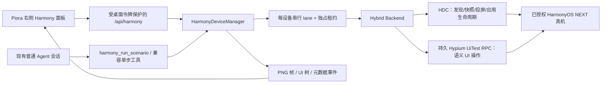

# Piora HarmonyOS NEXT 真机自动化技术设计

> 状态：0.4.40 持久语义自动化实现
> 更新：2026-09-02
> 目标：让 Piora Windows EXE 中的 AI 在用户明确授权后，通过电脑控制 HarmonyOS NEXT 测试手机，并在右侧工作区显示设备投屏。

## 1. 可行性结论

方案在“用户自有设备、开发者模式、USB 调试授权、外部安装官方 HDC/UiTest”的边界内可行。核心闭环包括：

1. HDC 发现设备并确认在线/授权状态。
2. UiTest 生成 UI 树和屏幕截图。
3. AI 读取结构化节点引用和必要截图。
4. 持久 Hypium RPC 执行语义动作；无法建立驱动时使用已有 HDC/UiTest 能力安全降级。
5. 同一次场景调用内完成动作、条件等待、断言和最终结构化验证。
6. 右侧工作区以截图帧持续显示当前手机界面，并支持人工点击与滑动。

这个结论不代表任意机型、系统版本和第三方 App 都已得到兼容性保证。UiTest 对自绘控件、安全页面、系统权限界面和不同零售固件的暴露程度必须用目标真机验证。

## 2. 产品边界

### 支持

- Windows x64 Piora 桌面应用。
- USB 连接的 HarmonyOS NEXT 真机。
- HDC 自动发现或用户选择绝对路径。
- 设备列表、型号、系统和 UiTest 能力诊断。
- UI 树、PNG 截图、节点引用。
- 坐标点击、节点点击、滑动、文本输入。
- Back、Home、Recents、Enter。
- 通过 bundle/ability 启动应用。
- 等待指定文本或 resource id。
- 右侧工作区本地投屏、点击映射、手动控制和紧急停止。
- 同一物理设备的独占控制租约、同设备串行队列和多设备并行。

### 不支持

- 绕过锁屏、USB 授权、系统权限、密码、验证码、生物认证、支付或风控。
- 向 AI 暴露 raw HDC、remote shell 或任意文件读写。测试应用的安装/卸载/清数据只通过有界结构化参数提供。
- 在安装包中再分发 Huawei SDK/HDC 二进制。
- 把约 1 FPS 的截图投屏描述为低延迟视频流。
- 承诺所有第三方应用都能提供完整可操作的 UI 树。

## 3. 总体架构

Electron main 进程负责进程监督、HDC/SDK 原生路径选择和每次启动随机生成的桌面令牌。Next standalone 子进程同时负责普通 AgentSession、Harmony API、设备管理器和 HDC 子进程。Renderer 没有通用进程启动 IPC。

## 4. 统一运行模式

Piora 使用统一运行模式。普通 AgentSession 直接加载第一方 `piora-harmony.ts`，现有会话无需重启即可使用 `harmony_*` 工具，并继续保留编码工具、项目/用户扩展、skills、prompts 和 context files。

因此工具确认不再被描述为进程或权限隔离。项目内容、第三方扩展和手机屏幕文字都可能影响同一 Agent；产品只提供防误操作控制：不可见的 prompt-run 租约令牌、每设备串行 lane、fresh generation/ref、严格参数校验、场景上限、急停和 run 结束自动回收。用户应只连接自有测试设备，不应把普通会话视为针对恶意项目或扩展的安全沙箱。

## 5. 设备管理器

`HarmonyDeviceManager` 是进程内唯一物理设备协调器，职责包括：

- 按确定顺序解析 HDC 绝对路径。
- 管理设备缓存、在线状态和连接 generation。
- 每设备只允许一个短期租约。
- 同一设备的写操作进入同一个串行 lane；不同实体设备可以并发执行。
- 为活动任务建立 AbortController；紧急停止取消活动和排队操作。
- 保存最新 UI 树引用；投屏的 screenshot-only 帧不会覆盖 AI 的 UI 树。
- 设备断开、状态变化、配置变化和紧急停止时使旧 generation/ref 失效。

HDC 命令通过 `spawn(executable, argv, { shell: false })` 调用，并带有：

- 绝对可执行文件校验。
- 固定参数模板。
- 运行超时和输出大小上限。
- AbortSignal。
- 隐藏窗口和非零退出码归一化。

用户或模型文本绝不进入 remote-shell 命令参数。文本先写入权限受限的本地临时文件，再通过 `hdc file send` 发送到随机生成的远端路径；固定命令从文件读取并作为一个引用参数传给 UiTest，finally 同时清理两端文件。

### 5.1 混合 backend 与持久驱动

`HybridHarmonyBackend` 不修改现有视频投屏、录屏、截图、UI 树、日志、进程和文件传输实现，这些调用直接委托给 `HdcBackend`。坐标动作和按键优先使用按设备复用的 `HypiumAutomationDriver`；语义动作直接使用 `BY` 与 `UiComponent` RPC。

驱动按需加载，在首次连接前把 Hypium 遥测写为关闭。连接失败进入 30 秒冷却，场景执行器可回退到实时 UI 树解析与 HDC 坐标动作。只有“连接建立前不可用”允许降级；已发送的 RPC 失败会使会话失效并原样报错，禁止用 HDC 重放可能已经执行的写动作。取消、设备离线、配置变化、急停和 manager dispose 都会断开会话。

## 6. 快照与动作一致性

每次包含 UI 树的快照生成：

- `generation`：同一序列号断开/重连或状态变化时递增。
- `revision`：每次快照递增。
- `ref`：`g<generation>-r<revision>-n<index>`。

`tap_ref` 必须提供最新 generation 和 ref。新 UI 树、重连或紧急停止会使旧 ref 失败。坐标操作也携带 generation；它只能降低误点风险，不能消除屏幕在捕获和执行之间变化的 TOCTOU 风险。

AI 的推荐流程是“snapshot → 识别目标 → tap_ref → 页面变化后重新 snapshot”。语义未知、自绘或敏感页面不得仅靠节点文字推断安全性；密码、验证码、支付和系统授权由用户手动完成。

## 7. 右侧设备投屏

Harmony 作为右侧工作区的独立工具标签，与 Files、Review、Browser 并列：

- 仅当该标签可见且所选设备在线时刷新。
- 下一帧在上一帧完成后才允许发起，避免请求堆积。
- 目标频率约 1 FPS；实际频率受 HDC/UiTest 截图耗时限制。
- 切走标签或关闭面板后立即停止轮询。
- 帧响应为 `private, no-store` PNG，不进入 SSE。
- 使用图片 natural size 与实际渲染矩形把指针映射为设备坐标。
- 短距离指针操作映射为 tap，长距离映射为 swipe。
- 点击/滑动要求人工租约，并带当前 generation。
- 画面覆盖层显示实时、更新或重连状态。
- 右侧面板现有“最大化”能力可扩大手机画面。

投屏是本地可视化和人工接管通道，不是 AI 的事实源；AI 仍使用带 UI 树和 revision 的 snapshot。

## 8. Agent 工具契约

模型首选 `harmony_run_scenario`。它自动取得当前 prompt run 的设备租约，一次提交 1–64 个步骤，并只返回每步状态、耗时、策略、失败原因和最终轻量 UI 树。默认不附带截图，输入正文不进入结果。

| 场景动作 | 作用 |
|---|---|
| `tap` / `double_tap` / `long_press` | 使用 id/text/type/hint/description/状态组合语义定位 |
| `input_text` / `clear_text` | 直接操作定位到的组件，正文不回显 |
| `scroll_find` | 在有界次数内滚动查找，可定位后点击 |
| `swipe` / `fling` / `press_key` | 使用屏幕相对方向或固定键枚举 |
| `wait_for` / `assert` / `wait_idle` | 等待可观察状态或执行即时断言 |
| `launch_app` / `stop_app` | 明确 bundle/ability 的应用生命周期 |
| `install_app` / `uninstall_app` / `clear_app_data` | 测试应用结构化维护操作 |
| `checkpoint` | 在结果中记录已完成的业务边界 |

原有的 `harmony_observe_screen`、点击、手势、输入、按键、等待、应用启动、日志、截图和录屏工具保持兼容，用于探索未知页面与失败恢复。单步观察默认只读取 UI 树，需要视觉模型或证据时才显式请求截图。

租约令牌只保存在服务进程内存中，永不写入模型结果、浏览器状态、日志或 session JSONL。租约 owner 使用不可由模型指定的真实 `sessionId/runId/toolCallId`。完整 prompt run 最终 idle、失败、abort、fork 或 wrapper destroy 时统一释放。

## 9. API 边界

所有 `/api/harmony/*`：

- 要求同源请求检查。
- 要求 Electron 每次启动随机生成并注入的 `X-Pi-Desktop-Token`。
- 不要求单独 runtime profile；现有会话与设备面板共用同一服务。
- JSON 写接口限制 Content-Type 和正文大小。
- 不提供 raw command 或 shell 参数。

主要端点：

- `GET /api/harmony/profile`
- `GET /api/harmony/devices`
- `GET /api/harmony/state`
- `GET /api/harmony/events`
- `GET /api/harmony/frame?serial=...`
- `GET /api/harmony/tree?serial=...`
- `GET|PUT /api/harmony/config`
- `POST /api/harmony/manual`
- `POST /api/harmony/action`
- `POST /api/harmony/scenario`

SSE 只发送设备、租约和操作元数据；不发送截图、完整 UI 树、输入正文或 bearer token。

## 10. 隐私与审计

- 本地投屏帧使用 no-store 响应，不落盘为长期缓存。
- HDC 临时截图/UI 树和输入文件均使用随机路径并 finally 清理。
- AI snapshot 的图片与节点文本会进入模型上下文，可能被模型提供商处理并写入 Pi session。
- 输入正文不出现在工具输出和 Harmony 操作结果中，只返回字符数。
- 用户应使用测试设备/账号，并在 AI 控制前关闭包含私密内容的通知。

## 11. 打包策略

- Piora 打包第一方 Harmony extension、manager/backend 源码、run identity registry，以及锁定版本的 `hypium-driver` 与它的完整生产依赖/UiTest agent 资源。
- 不打包 Huawei HDC；现有视频投屏实现和资源保持不变。
- 用户从 DevEco Studio 或官方 Command Line Tools 提供 `hdc.exe`。
- Windows portable 使用统一的标准 `vX.Y.Z` tag，不再维护独立 Harmony 版本线。
- GitHub Actions 在干净依赖环境执行 lint、typecheck、unit tests、license/hygiene、standalone 校验、portable smoke，并发布 SHA-256。

## 12. 验证矩阵

### 自动化发布 Gate

- 普通 new/resume/events/fork/duplicate 会话均可发现 `harmony_run_scenario` 与兼容单步工具。
- 不存在模式切换、服务重启或会话列表分区。
- 设备租约冲突、过期、owner 释放和紧急停止。
- 同设备队列串行、多设备并行及取消。
- Hypium 持久连接复用、隐私准备、连接冷却、HDC 降级与防重复写操作。
- 语义选择器歧义/缺失、批量场景等待/断言、失败停止和输入结果脱敏。
- HDC 路径解析、旧版 target list fallback。
- 截图和 UI tree 文件大小/格式限制。
- 文本元字符不进入 HDC/remote-shell argv。
- UI ref generation/revision 陈旧保护。
- 投屏不覆盖 AI UI tree，隐藏时停止。
- Desktop 统一数据目录、旧 Harmony 配置迁移和托盘启动。
- 最终 portable packaged-runtime smoke。

### 真机 Gate

至少覆盖目标机型上的：

1. 首次/重复 USB 授权、未授权和拔插。
2. 竖屏/横屏截图、分辨率和坐标映射。
3. 系统应用、自有 HAP、至少两个目标第三方 App 的 UI 树。
4. 点击、连续滑动、Back/Home/Recents/Enter。
5. 中英文、空格、引号、分号、换行和 emoji 文本输入。
6. app launch、wait_for、页面重载后的 stale ref。
7. AI 运行中人工观看、租约冲突、紧急停止和 Agent abort。
8. 30 分钟连续投屏与 500 次动作稳定性。

CI 没有实体手机，因此不能替代这组硬件验收。

## 13. 已知限制和后续演进

- 当前投屏是截图轮询，不是 H.264/视频流；低延迟投屏要在授权明确后单独选择官方或可再分发组件。
- UiTest CLI 版本能力存在差异，文本输入要求支持 coordinate-free text 的版本。
- 设备端页面变化无法与截图形成原子事务，所有动作仍存在有限 TOCTOU。
- 不同物理设备使用独立 lane 并行；每台设备内部仍严格串行，并由实机长稳测试验证目标设备矩阵。
- Hypium 当前按设备懒加载在服务进程内以减少动作延迟；如果目标设备矩阵的长稳测试证明第三方驱动存在不可控泄漏或崩溃，再迁移到受监督 worker，并补 Windows Job Object 与自动恢复。
- 若产品要把“阻止同用户其他进程调用 HDC”作为安全承诺，必须另加 OS 级进程/凭据/设备访问隔离；当前实现不作此承诺。

## 14. 0.2.1 增量：运行时发现与双模型感知

### 14.1 HDC/SDK 发现

`discoverHdcCandidates()` 统一枚举用户选择、环境变量、已保存配置、DevEco 常见安装目录和 `PATH`。候选项同时携带 `hdcPath`、推断的 `sdkPath` 和来源，渲染器只通过受信 Electron IPC 请求原生文件/目录选择；渲染器不能读取任意目录。用户选择 SDK 根目录时仅检查固定相对路径和直接版本子目录，不递归扫描磁盘。

### 14.2 双模型感知

设备快照仍由 `HarmonyDeviceManager` 一次生成。启用视觉路由时，截图作为独立、无历史的图片请求发送给用户选择的 image-capable 模型，返回受提示约束的观察文本；操作模型继续使用 revision-scoped UI refs、UI 树和观察文本。默认不把原图加入操作模型 tool result，避免同一屏幕被发送给两个提供商。视觉失败会作为结构化 warning 返回，UI 树路径仍可继续。

### 14.3 可选工作流扩展边界

设备控制运行时不再集成目标模式，也不接受 `goalMode` 请求字段。`piora-goal` 和 `piora-plan` 仅属于 normal profile 下默认关闭的可选扩展；启用后通过普通扩展工具工作，不改变 Harmony 的设备租约、审批队列或 `AgentSessionWrapper` 生命周期。设备控制任务需要持续执行时，应由调用方显式发送后续消息或使用独立的调度能力，核心运行时不会自动续接模型回合。
