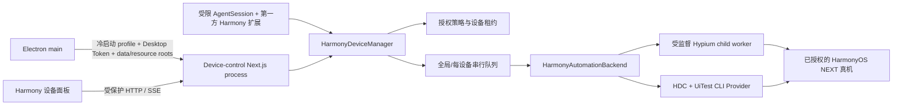
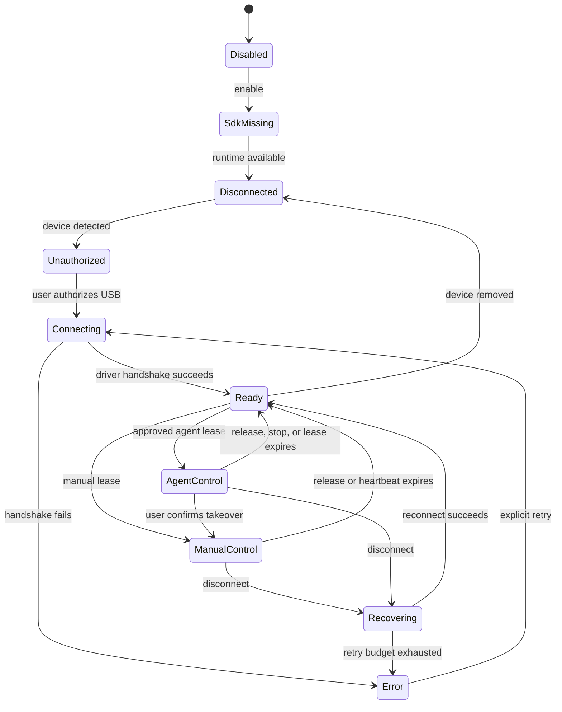

# Piora 集成 HarmonyOS NEXT 真机自动化控制：可行性与技术设计

> 状态：设计稿 v0.1，尚未进入开发
> 日期：2026-08-12
> 适用项目：Piora Windows EXE
> 前置调研：Codex 会话 `019ff602-345e-7fd2-9e61-87785e1159ac`

本文把“鸿蒙单框架手机”理解为纯血鸿蒙/HarmonyOS NEXT 原生系统手机，而不是仍可运行 Android 应用的旧兼容栈设备。如果实际目标含义不同，应先调整 P0 设备矩阵和 Provider 判断。

## 1. 结论先行

### 1.1 总体判断

把 HarmonyOS NEXT 真机自动化能力集成进 Piora EXE，**官方原子能力层面可行，面向目标零售机和第三方应用的产品化有条件可行**。

这不是说 P0 前已经证明 Piora 能跨任意第三方应用稳定控制。当前证据足以支持立项和实机 Spike；“目标机型 + 目标应用可控制”仍是 P0 必须用真机证明的条件性假设。若最终只能稳定控制团队自有 HAP，产品范围就应收窄为“连接设备测试”，而不是通用手机自动化。

这里的“可行”限定为：

- 手机是 HarmonyOS NEXT 原生系统设备；具体支持版本和机型需由实机矩阵确认。
- 用户拥有设备并主动开启开发者模式、USB 调试和连接授权。
- Piora 运行在 Windows 桌面端，首版通过 USB 连接设备。
- 自动化目标是读取 UI、截图、点击、滑动、输入、按键、启动允许的应用，以及组合这些原子能力执行测试或辅助操作。
- 不尝试绕过锁屏、密码、支付、验证码、风控、系统授权或应用自身权限。

官方 HDC、UiTest/ArkXtest、Hypium 已经覆盖连接、UI 查询、截图和输入控制等基础能力。真正决定能否商用交付的，不是“能不能点手机”，而是下面四个门槛：

1. `hypium-driver`、HDC 预编译文件和设备侧二进制的再分发授权是否明确。
2. Piora 目标机型和 HarmonyOS 版本上的兼容性是否通过实机长稳测试。
3. Piora 当前完整编码工具权限与手机控制授权之间，是否建立诚实且可执行的安全边界。
4. 低延迟投屏是否真的属于首版需求；它比 UI 自动化本身更不确定，不能作为核心链路的前置条件。

### 1.2 建议决策

当前建议是：**架构立项 Go，产品开发 Conditional Go**。

- 可以立即确认总体架构、接口、安全模型和验收门槛。
- 下一步应先做独立的 P0 实机与授权验证，不直接改产品功能。
- P0 通过后，再按“手动设备面板 → 受控 Agent 自动化 → 稳定性增强 → 可选直播”的顺序开发。

### 1.3 能力可行性分级

| 能力 | 当前判断 | 首版承诺 |
|---|---|---|
| USB 设备发现、连接和授权状态 | 高可行 | 支持 |
| UI 树、控件查询、点击、滑动、按键 | 官方测试能力成立；跨目标第三方应用待 P0 | P0 达标后支持 |
| 按需截图、操作前后画面 | 官方能力成立；零售机限制待 P0 | P0 达标后支持 |
| 中文输入、复杂输入法、自绘控件 | 中等可行，差异较大 | 有条件支持 |
| ArkWeb 中不可见的网页节点、Canvas、游戏等无语义页面 | 中等或偏低，需视觉/坐标回退 | 有条件支持；ArkWeb 本身另有官方自动化路径 |
| USB 断连恢复 | 中高可行 | 支持，按验收指标约束 |
| Wi-Fi 调试 | 可行但稳定性较弱 | 首版不承诺 |
| 低延迟实时投屏 | 技术可行，但公开嵌入和再分发边界不清楚 | 首版不依赖 |
| 无开发者模式的普通消费者设备 | 不可行/不应做 | 不支持 |
| 锁屏、密码、支付、隐私窗口自动化 | 不可靠且不应绕过 | 明确禁止 |
| 同一设备多会话并发控制 | UiTest 模块不支持并发，且风险高 | 不支持；强制串行和独占租约 |
| 多台设备并行 | Hypium Node 的进程/设备隔离尚未证明 | P0 前全局串行；验证隔离后再开放 |

## 2. 产品范围

### 2.1 目标用户和场景

首版面向以下场景：

- 开发者或测试人员把自己的 HarmonyOS NEXT 真机连接到 Piora。
- 用户在 Piora 右侧设备面板中查看设备状态和最新截图，并手动点击、滑动、输入或按键。
- 用户在冷启动设备控制模式中，显式允许某个受限 Agent run 在指定设备和指定应用范围内执行自动化。
- Agent 先观察 UI 树和截图，再调用结构化动作，完成测试、重复性操作或问题复现。
- 用户随时可以手动接管、撤销授权或执行紧急停止。

### 2.2 首版范围

下列“首版”指 P0 证明目标机型/应用能力、并明确 Provider 分发路径之后的产品目标，不是本文完成即已承诺：

- Windows x64 Piora EXE。
- 单机可发现一台或多台 USB 设备；首版至少保证一台活动设备。P0 证明 Driver 按设备隔离后才开放多设备并行，否则全局串行。
- 设备发现、授权诊断、在线状态和前台应用信息。
- UI 树和按需截图。
- 控件点击、坐标点击、滑动、非敏感文本输入；Agent 首版只开放 Back/Home，Recents/Enter 仅保留为手动面板能力。
- 启动用户允许列表中的应用。
- 手动设备面板。
- Agent 的 run 级控制授权、独占租约、自动过期和紧急停止。
- 结构化、脱敏的本地审计记录。

### 2.3 明确不做

首版不包含：

- 通用 `hdc shell`、任意命令、任意脚本执行。
- 安装/卸载应用、清除应用数据、修改权限、推送/拉取任意文件。
- 自动解锁、输入 PIN/密码、读取或提交 OTP、支付或生物认证。
- 绕过应用登录、验证码、风控、设备认证和业务权限。
- 后台隐蔽控制或未经用户可见授权的长期无人值守。
- 把实时 15–30 FPS 投屏作为自动化成立的必要条件。
- 把社区逆向得到的设备代理二进制内置到 Piora。
- 对所有 HarmonyOS NEXT 机型和未来系统升级作无条件兼容承诺。

## 3. 技术依据与生态判断

### 3.1 官方能力已经覆盖核心闭环

| 官方能力 | 已确认用途 | 对 Piora 的意义 |
|---|---|---|
| [HDC 官方指南](https://developer.huawei.com/consumer/cn/doc/harmonyos-guides/hdc) / [OpenHarmony HDC](https://github.com/openharmony/developtools_hdc) | Windows 主机连接设备，支持 USB/TCP、设备选择、Shell、文件和转发等调试能力 | 作为设备发现、连接、诊断和底层通道；Piora 只封装白名单子集 |
| [UiTest API](https://developer.huawei.com/consumer/cn/doc/harmonyos-references/js-apis-uitest) / [ArkXtest](https://gitee.com/openharmony/testfwk_arkxtest) | UI 查询、点击、输入、滑动、按键、截图、窗口等自动化能力；官方明确本模块接口不支持并发调用 | 证明测试场景中的 UI 语义自动化可行；并发粒度要由 P0 验证，P0 前按全局串行设计 |
| [Hypium Python 指南](https://developer.huawei.com/consumer/cn/doc/harmonyos-guides/hypium-python-guidelines) / [Hypium PyPI](https://pypi.org/project/hypium/) | 作为主机端测试驱动，提供控件、图像、设备和应用操作 | 可作为备用 Provider；不应让首版被 Python 运行时绑死 |
| [DevEco Testing 入门](https://developer.huawei.com/consumer/cn/testing/get-started/) | 本地真机、Hypium UI 自动化和测试执行 | 说明官方测试工具链已经具备完整能力方向 |
| [DevEco Studio](https://developer.huawei.com/consumer/cn/deveco-studio) | 连接设备后的镜像和键鼠交互 | 证明设备镜像控制在官方工具中可实现，但不等于允许第三方直接嵌入其内部组件 |
| [官方屏幕录制](https://developer.huawei.com/consumer/cn/doc/harmonyos-guides/ide-screen-recording) / [Hypium 性能测试限制](https://developer.huawei.com/consumer/cn/doc/doccenter-testing/hypium-perf-python-guidelines) | 生成录屏文件；官方录屏页明确锁屏约束，性能测试资料还说明银行/密码等隐私界面不可录屏 | 可作诊断能力，不应被误当成低延迟直播 API；录屏限制不能直接推出 screenshot/UI 树必然被系统阻断 |
| [鸿蒙生态测试白皮书](https://developer.huawei.com/consumer/cn/doc/guidebook/harmonyecoapp-guidebook-0000001761818040/) | 已列出 Hypium 设备测试 MCP 等新能力方向 | 可作为未来 Provider 观察项；当前公开嵌入接口不足以作为首版依赖 |
| [ArkWeb Hypium 自动化指南](https://developer.huawei.com/consumer/cn/doc/harmonyos-guides/web-hypium-autotests) | 官方提供 ArkWeb 专门自动化路径 | 不把 ArkWeb 整体视作无语义页面；只对实际不可见节点使用视觉回退 |

截至本文日期，npm 上的 [`hypium-driver` 6.1.210](https://www.npmjs.com/package/hypium-driver) 发布于 2026-05-19，提供 Node 侧 UI 驱动接口，并包含 `uitest_agent*.so`、`libscrcpy_server*.so` 等设备模块。其包内 `package.json` 版本字符串异常写作 `6.1.0210`，README 推荐 Node 20.11.1，因此 Piora 的 Node 22 兼容性必须实测。npm 元数据声明 ISC，但 [tarball 文件清单](https://unpkg.com/hypium-driver@6.1.210/?meta) 中没有独立 LICENSE 文件；元数据许可证不能自动覆盖包内设备侧二进制的再分发权，正式随 EXE 打包前必须完成逐文件来源和书面授权核验。Python `hypium` 当前 PyPI 版本为 `6.1.0.210`，其 license 元数据为空，也不能据此判断可分发。

还要注意，官方文档主要把 UiTest/Hypium 定位为应用测试能力。某些系统版本或设备可能要求额外测试模式、重启或设备侧组件；“能测试自己的 HAP”也不自动等于“能跨任意第三方应用控制零售机”。所以，目标零售设备上的跨应用能力必须作为 P0 的硬 Gate，不可仅凭 API 列表默认成立。

### 3.2 社区方案只作参考或可选适配

| 方案 | 价值 | 结论 |
|---|---|---|
| [appium-harmonyos-driver](https://github.com/zhihu/appium-harmonyos-driver) | 项目声称可连接 Appium/WebDriver 生态；当前版本 1.0.1、Apache-2.0、无 GitHub Release，并依赖 Appium 3 RC 时代接口和 `hypium-driver` | 能力与维护性待 P0；若未来兼容既有 Appium 资产，可做可选桥接，Piora 核心不引入 Appium Server |
| [Appium 官方驱动列表](https://appium.io/docs/en/latest/ecosystem/drivers/) | 可核对官方维护范围 | HarmonyOS 驱动不在官方驱动目录中，不应对其维护等级作官方承诺 |
| [hmdriver2](https://github.com/codematrixer/hmdriver2) | 能证明社区可以完成 UI 树、截图和设备控制 | 仓库内含来源和再分发边界不够清晰的设备代理二进制；只可实验室对比，不进入产品依赖 |
| [HOScrcpy](https://gitcode.com/OpenHarmonyToolkitsPlaza/HOScrcpy) | 能证明低延迟 H.264 投屏和控制方向可行 | 核心 JAR、许可证和商用再分发信息不够清晰；拿到书面授权后才可成为可选直播 Provider |

### 3.3 不能从现有证据推出的结论

以下事项仍需 P0 实测或法务确认，不能写进产品承诺：

- npm 包在 Piora 当前 Node 22 运行时上的长期稳定性。
- 包内所有 `.so`、Windows 工具和传递依赖可随商业 EXE 再分发。
- DevEco Studio 的镜像组件存在公开、稳定、可嵌入的第三方 API。
- 所有目标机型都保留相同 UiTest CLI、节点属性和输入行为。
- 实时视频通道与 UI 自动化并行时不会互相抢占设备侧服务。
- 系统升级后私有协议或非公开命令仍兼容。

## 4. 与 Piora 现有架构的结合点

Piora 已经有一套很适合复用的“浏览器工具”模式：

- Electron 主进程只负责启动/监督 Next.js standalone 服务和传递受控环境信息。
- Pi `AgentSession` 在 Next.js 进程内运行。
- `extensions/piora-browser.ts` 提供 Agent 工具和全局运行时。
- `app/api/browser/*` 给桌面 UI 暴露受保护的 HTTP 接口。
- `BrowserPanel` 负责可见状态、手动交互和截图更新。
- Electron renderer 开启 `sandbox` 和 `contextIsolation`，preload 保持很小，不直接持有文件、进程和凭据能力。

Harmony 控制应沿用这个边界，而不是在 renderer 中直接启动 HDC。不过，正式 Agent 控制不能只在当前 Next 进程内隐藏几个工具；它需要冷启动的专用运行模式：



Piora 运行模式：

- `normal`：现有完整编码工具、项目/用户扩展和 skills 正常工作；Harmony DeviceManager 不启动，不能武装手机。
- `device-control`：Electron 停止全部活动 run，终止当前 standalone server，再用 `PIORA_RUNTIME_PROFILE=device-control` 冷启动干净服务进程。该进程从未加载项目/用户扩展、skills、prompts 或 hooks，只提供受信第一方 Harmony 工具和设备面板所需能力。
- 离开设备控制模式时再次重启服务，不能在同一 Node 进程中热切换 profile 或复用旧的 `globalThis`/service cache。

这样可以清理旧 Node 进程中的 timer、全局对象和 ResourceLoader/service cache，并终止 Piora 能追踪的 child worker；它不能清除旧任务启动后逃逸追踪的 detached helper。该模式不是 Windows OS 级沙箱：任何既存同用户进程（包括旧 Piora 任务留下的后台进程）都可能访问手机。若未来需要对抗这类进程，必须加入 Windows Job Object 等完整进程 containment，或使用 OS 用户/VM/设备专属主机隔离。

### 4.1 进程职责

#### Electron 主进程

只负责：

- 选择 `normal` 或 `device-control` 冷启动 profile，并监督服务进程切换。
- 通过一个窄的 main-frame-only preload IPC 接收模式切换请求，并显示 Electron 原生确认；不提供可由 Next API、Agent tool 或命令参数直接切换 profile 的入口。
- 传递静态的打包资源根和 `app.getPath("userData")`；建议新增 `PIORA_DESKTOP_DATA_DIR`，不把动态用户 SDK 路径固化在启动环境变量中。
- 沿用现有的服务生命周期、随机端口和 Desktop Token 机制。
- 打包版本中验证资源清单和完整性。

不负责：

- 不在 preload 暴露 `hdc`、Shell 或任意进程执行 IPC。
- 不把设备凭据、控制令牌或截图注入 renderer。

#### Next.js standalone 进程

负责：

- 运行 `HarmonyDeviceManager` 全局单例。
- 只有在 `device-control` profile 下才初始化 DeviceManager 和 Harmony 路由。
- 发现设备、维护连接、快照、租约、动作队列和事件订阅。
- 执行固定模板的 HDC/Driver 调用，统一超时、取消、输出上限和错误码。
- 为桌面面板提供受保护 API。
- 为 Pi 的受信扩展提供同进程内部调用接口。
- 把外部 SDK 配置原子保存到 `PIORA_DESKTOP_DATA_DIR/harmony/config.json`；配置变更时先排空/取消队列，再重新创建 Backend，无需回写 Electron 环境变量。

#### Renderer

只负责：

- 展示设备状态、最新截图、UI 节点和控制权归属。
- 发起结构化的手动操作。
- 展示并确认 Agent 控制申请。
- 提供“立即停止”和“接管设备”。

它不接触 HDC 路径、不拼 Shell、不持有 Agent 控制租约密钥。

### 4.2 哪些部分必须独立进程

策略、租约、API、审计和轻量 HDC CLI runner 可以先保留在冷启动的 Next `device-control` 进程内，以复用现有 HTTP/SSE 和 AgentSession 生命周期。

`HypiumNodeBackend` 从 P0 起就必须运行在受监督 child worker，而不是等长稳出问题后再拆，原因是当前包的 [device.js 实现](https://unpkg.com/hypium-driver@6.1.210/build/lib/device.js) 显示：

- 通过 `PATH` 查找 `hdc`，没有公开的 `hdcPath` 参数。
- 内部会拼命令字符串再经解析库执行，不能直接继承 Piora 自研 runner 的绝对路径保证。
- 会上传设备 agent、启动 UiTest daemon，并在部分路径执行 `killall -9 uitest`，可能干扰 DevEco Testing 或其他 Hypium 会话。
- Driver 崩溃、端口、全局状态和内存泄漏不应拖垮 Piora 服务。

worker 启动时使用最小环境变量和净化后的临时 `PATH`，其中只放一个由 Piora 校验过的 HDC 入口；不继承用户 PATH。worker 协议只接受结构化白名单动作，不接受任意命令字符串。即便如此，“不会干扰外部测试工具”仍需 P0 实测，不能只靠进程隔离推断。

如果最终不采用 Hypium Node、而自研 CLI Backend 已满足 P0，则可以不额外常驻 sidecar。若多设备隔离未证明，Manager 在所有设备上使用一个全局执行 mutex。

## 5. 核心模块设计

### 5.1 `HarmonyRuntimeLocator`

职责：

- 优先使用用户选择并确认的 SDK/Command Line Tools 目录。
- 再扫描 DevEco Studio 的已知安装位置，但扫描结果只作候选，不能直接执行未知文件。
- 自研 CLI runner 对 `hdc.exe` 使用绝对路径，检查版本、文件存在性和可执行性。
- `hypium-driver` 当前只能按 PATH 查找 HDC；其 worker 使用只包含已验证 HDC wrapper/目录的净化 PATH，不继承系统 PATH。
- 打包模式下校验资源清单、版本和哈希。
- 记录来源是 `external-sdk`、`bundled` 还是 `unavailable`。

### 5.2 `HarmonyDeviceManager`

这是进程级全局单例，以设备序列号为键保存：

- 连接状态和最近心跳。
- 设备型号、系统版本、方向和前台应用。
- 当前 Backend 和 Driver 版本。
- 当前手动/Agent 租约。
- 串行动作队列、当前操作 ID 和取消控制器。
- 最新截图、紧凑 UI 树和快照 revision。
- SSE 订阅者集合。
- 重连退避和最近错误。

Next.js 热更新下应使用 `globalThis` 复用 Manager，思路与 Piora 现有 AgentSession/Browser 运行时一致；切换 runtime profile 时则必须结束整个服务进程，不能复用该全局对象。测试结束和应用退出时不应粗暴杀死用户共享的全局 HDC server。

当前 `hypium-driver` 可能上传 `/data/local/tmp/agent.so`、启动 `uitest start-daemon singleness`，并在更新/重置路径执行 `killall -9 uitest`；断开并不保证删除 agent 或停止 daemon。因此“只清理 Piora 自己的实例”暂时只是目标，不是现成 Driver 已满足的事实。与 DevEco Testing/其他 Hypium 会话的共存、残留发现和可恢复清理必须成为 P0 硬 Gate；无法证明时，UI 要求独占设备测试时段，并在退出时给用户明确诊断。

### 5.3 `HarmonyAutomationBackend`

建议先固定下面的逻辑接口，具体 Provider 可以替换：

```ts
interface HarmonyAutomationBackend {
  probe(): Promise<BackendCapabilities>;
  listDevices(signal?: AbortSignal): Promise<DeviceDescriptor[]>;
  connect(serial: string, signal?: AbortSignal): Promise<DeviceSession>;
  disconnect(serial: string): Promise<void>;

  snapshot(serial: string, options: SnapshotOptions): Promise<DeviceSnapshot>;
  tap(serial: string, point: DevicePoint): Promise<void>;
  swipe(serial: string, gesture: SwipeGesture): Promise<void>;
  inputText(serial: string, text: string): Promise<void>;
  pressKey(serial: string, key: AllowedKey): Promise<void>;
  launchApp(serial: string, bundleName: string): Promise<void>;
  getForegroundApp(serial: string): Promise<ForegroundApp | null>;
}
```

这里故意没有 `shell(command)`、`pushFile()`、`install()` 或任意脚本入口。

### 5.4 Provider 优先级

| Provider | 定位 | 进入主产品的条件 |
|---|---|---|
| `HypiumNodeBackend` | 优先验证的语义驱动；在受监督 worker 中运行，避免 Appium/Python 中间层 | Node 22、目标机型、长稳、外部工具共存/清理和包内二进制授权全部通过 |
| `HdcUiTestCliBackend` | 连接、诊断和低依赖回退；优先使用用户已有官方 HDC 与设备内置命令 | 公开命令在目标系统上稳定，且无需分发未授权设备代理 |
| `HypiumPythonBackend` | Node Driver 不满足要求时的官方能力备选 | 只有 P0 证明 Node 路线不可用时才承担 Python sidecar 成本 |
| `AppiumBridgeBackend` | 兼容企业已有 WebDriver/Appium 测试资产 | 作为后续插件，不进入 Piora 核心控制链 |
| `LiveVideoBackend` | 可选低延迟视频源 | 公开 API、商用授权、资源占用和并行稳定性均明确后再启用 |

不实现 `hmdriver2` 生产 Provider，不分发其内置 agent；HOScrcpy 只保留授权后的研究入口。

### 5.5 固定命令模板

Piora 自研 CLI runner 的所有子进程调用都必须满足：

- `shell: false`。
- Windows 子进程使用 `windowsHide: true`，不弹出控制台窗口。
- 可执行文件为已验证的绝对路径。
- 参数使用数组传递，不拼接命令行字符串。
- `serial`、bundle name、按键和坐标都做格式及范围校验。
- 每类操作有独立超时、输出字节上限和 `AbortSignal`。
- stdout/stderr 先做大小限制，再映射为内部错误，不直接回传给模型。
- 不把用户/模型文本传入任何 remote-shell 命令行。

`shell:false` 只保证 Windows 主机不再套一层 Shell，**不能阻止 `hdc shell ...` 在手机端解释字符串**。因此还要满足：

- `input_text` 必须走 Driver RPC/gRPC、结构化 stdin、长度前缀协议或经过验证的设备文件通道；如果 Provider 只能把文本拼到 `hdc shell`，该 Provider 不开放文本输入。
- bundle、serial、ability、key 等进入 remote command 的值必须来自服务端严格枚举/allowlist，并限制字符集和长度；不能只“转义一下”模型文本。
- 当前 `hypium-driver` 内部会拼命令字符串并通过解析库执行，必须在 P0 审计每条将用户数据送往设备的调用路径。未证明安全的 action 从 capability 列表中移除。
- 任何 API 都不接受 raw remote command；命令元字符测试必须进入负向测试集。

建议初始超时：普通动作 10 秒、快照 15 秒、首次连接 30 秒。P0 用实际数据调整，不能无限等待。

## 6. 设备状态、租约与并发模型

### 6.1 状态机



状态必须区分“检测到但未授权”“HDC 在线但 Driver 失败”“截图被拒或持续空白”等情况，不能把所有失败显示成“设备离线”，也不能自动把空白归因为隐私界面。

实现层不要把所有组合塞进一个不断膨胀的 enum。内部状态应拆成四个正交维度，状态图只是 UI 投影：

| 维度 | 状态示例 |
|---|---|
| Transport | disabled / runtime_missing / disconnected / unauthorized / probing / connected / recovering / error |
| Capability | unknown / observe_only / interactive / degraded / unsupported |
| Lease | disarmed / agent_armed / manual_hold |
| Job | idle / queued / executing / awaiting_confirmation / cancelling |

### 6.2 设备级独占租约

基本规则：**一台物理设备同一时间只能有一个控制者**。

建议默认值：

- Agent 租约：绑定当前 Agent run；run 结束或绝对 10 分钟先到者立即过期。
- 手动面板租约：面板激活时每 15 秒心跳，连续 45 秒无心跳自动释放。
- Agent 若需继续控制，必须发起新的本地授权；不提供“永久允许”。
- 设备断开、Agent run 结束、会话结束、应用退出、模式切换或紧急停止时立即撤销租约。
- 手动接管 Agent 必须由用户明确确认；确认后先取消排队动作，再释放 Agent 租约。
- Agent 不能自行延长最大授权，也不能把租约转给另一个会话或设备。

租约归属建议保存为：

```ts
type DeviceLease = {
  leaseId: string;          // 仅服务端持有，不返回给模型
  deviceId: string;
  ownerType: "manual" | "agent";
  ownerSessionId?: string;
  ownerRunId?: string;
  connectionGeneration: number;
  allowedBundles: string[];
  grantedAt: number;
  absoluteExpiresAt: number;
};
```

### 6.3 每设备串行队列

- 每个序列号一个 FIFO 队列；P0 前再加全局执行 mutex。只有实测证明 Driver/设备 daemon 完全隔离后，才允许不同设备队列并行。
- HDC 设备发现、端口分配和 daemon 生命周期另有全局 mutex，避免多个设备 worker 同时改共享主机状态。
- 入队时再次检查租约，执行前再检查一次，避免等待期间授权已失效。
- 每个操作带单调递增 `operationId`。
- Agent 写操作同时使用 SDK 提供的 `toolCallId` 作服务端去重键，不接受模型自造的幂等键。
- 建议单设备队列上限为 20；单次 Agent run 的写操作预算为 50；持续速率不高于每秒 2 次。达到上限后 fail closed，不继续堆积。
- 断连、接管、撤销或超时会取消当前操作并清空尚未执行的写操作。
- Driver 返回后必须确认该操作仍属于当前租约，旧请求结果不能覆盖新状态。
- 读快照可以合并重复请求；写动作绝不合并或重排。
- 人工确认期间不占用底层 Driver mutex；用户批准后必须在队首重新抓取设备快照、解析目标，并检查 connection generation、前台应用、rotation、节点 fingerprint 和 bounds。任何变化都使批准失效。

这与 Piora 现有 prompt run 使用单调 run id 防止旧 SSE 结果“复活”的原则一致。

## 7. 快照、UI 定位与画面设计

### 7.1 快照是自动化事实源

一次快照建议包含：

```ts
type DeviceSnapshot = {
  deviceId: string;
  revision: number;
  capturedAt: number;
  display: {
    widthPx: number;
    heightPx: number;
    rotation: 0 | 90 | 180 | 270;
    contentInsets: { top: number; right: number; bottom: number; left: number };
  };
  foregroundApp: { bundleName: string; abilityName?: string } | null;
  screenshot?: { mimeType: "image/jpeg" | "image/png"; bytes: Uint8Array };
  nodes: CompactUiNode[];
  captureRestriction: "none" | "suspected" | "reported";
};
```

每个可操作节点生成短 `ref`，例如 `n17`。`ref` 只在当前 `{deviceId, revision}` 中有效。`tap_ref` 必须携带 revision；服务端发现页面已经变化时返回 `STALE_SNAPSHOT`，要求 Agent 重新观察，不能拿旧坐标盲点。

必须明确：`revision` 是 Piora 对“已经观察到的快照”的本地编号，不是设备端事务版本，不能证明截图后页面没有变化。每个写动作在真正执行前都要：

1. 等待设备尽可能 idle。
2. 在串行队列头获取新的 preflight 快照。
3. 通过稳定 selector 重新解析 ref，并比对前台应用、rotation、节点类型、文本摘要、bounds 和可点击状态。
4. 不匹配就拒绝；匹配时优先用语义 selector 执行动作，不把旧 bounds 当作事实。

快照和点击之间仍存在无法完全消除的 TOCTOU 窗口。坐标动作尤其不能被描述为强安全绑定：Agent 坐标点击默认逐次确认，高风险流程只支持经审核的固定应用/步骤，或要求用户手工完成。

设备每次重连还要生成新的 `connectionGeneration`。即使设备序列号相同，旧连接上的租约、ref、截图和待执行动作也不能迁移到新 generation，更不能因为“当前只剩一台手机”而自动换绑设备。

### 7.2 定位优先级

从稳定到不稳定依次使用：

1. resource/id 或稳定 accessibility 标识。
2. 角色/类型 + 精确文本 + 可见/可点击状态。
3. 结构化相对位置。
4. 文本模糊匹配。
5. 截图视觉定位。
6. 绝对坐标，只作为最后回退。

Agent 输出中不直接塞完整 XML/JSON UI 树。服务端保留完整树，只返回可见、可交互、与任务相关的紧凑节点，避免把数百 KB 节点数据注入模型上下文。

### 7.3 坐标变换

面板中的点击位置先从图像显示坐标映射到快照内容坐标，再结合 rotation 和系统 inset 转成设备物理坐标。任何点击都必须绑定截图 revision、原始尺寸和显示方向。

折叠屏展开/合拢、横竖屏变化或分辨率变化一旦被 Piora 观察到，就立即使旧 revision 失效。不得只按当前 DOM 中图片元素的宽高比例盲算坐标。

### 7.4 首版画面刷新

首版目标是“可操作的准实时画面”，不是直播：

- 面板可见时按需以约 1–3 FPS 获取最新截图；实际频率由 P0 性能决定。
- 面板隐藏或应用退到后台时停止轮询。
- 每次写动作完成后立即触发一次新快照。
- SSE 只推送状态和 `frameRevision`，图片通过独立 `no-store` 接口拉取，避免在 SSE 中反复传大块 Base64。
- UI 树可以低于截图频率更新，Agent 每次决策前显式获取完整快照。

如果 1–3 FPS 已足以手动确认和 Agent 自动化，P1 即可交付。低延迟 H.264 直播放到 P4，不拖累核心能力。

## 8. Piora UI 设计

在现有右侧工作区新增 `Harmony` 标签页，结构建议如下：

```text
┌ Harmony Device ─────────────────────┐
│ Device: My Mate …A17  USB · Ready   │
│ OS 6.x | Driver 6.x | App com.foo   │
│                                      │
│          最新设备截图                │
│      点击画面可执行手动 Tap           │
│                                      │
│ [Back] [Home] [Recents] [Refresh]   │
│ Text: [________________] [Send]      │
│                                      │
│ Control: Agent task-name · 02:31     │
│ [Take over] [Stop now]               │
│                                      │
│ Diagnostics: UI tree ✓  Screen ✓     │
└──────────────────────────────────────┘
```

### 8.1 首次连接向导

向导只指导用户完成合法、可见的开发调试配置：

1. 选择或检测 DevEco Studio/Command Line Tools。
2. 展示检测到的 `hdc` 版本和来源。
3. 提示用户在手机上开启开发者模式、USB 调试并确认授权。
4. 显示已检测设备；序列号默认只显示尾号。
5. 执行只读诊断：设备信息、UI 树、截图。
6. 明确提示开发者模式扩大了设备攻击面，不使用时应关闭或撤销授权。

Piora 不尝试替用户自动开启开发者模式，也不模拟或绕过手机侧授权弹窗。

### 8.2 控制权可见性

无论用户停留在哪个 Piora 标签页，只要 Agent 持有设备控制权，都应有全局可见状态：

- 设备别名。
- 当前任务名称。
- 剩余空闲时间和最大授权时间。
- 红色“立即停止”入口。

Agent 控制期间，手动点击截图不能静默与 Agent 并发。用户选择“接管”后，先撤销 Agent、取消队列，再开始手动操作。

## 9. Agent 工具设计

### 9.1 单一受信工具

建议只注册一个顺序执行的工具 `harmony_device`，用 `action` 判别操作，而不是暴露多个可以绕开统一策略的零散工具。

首版动作：

- `list_devices`
- `acquire_control`
- `release_control`
- `snapshot`
- `tap_ref`
- `tap_point`
- `swipe`
- `input_text`
- `press_key`
- `wait_for`
- `launch_app`

工具设置 `executionMode: "sequential"`。除了脱敏的设备列表外，读取截图和 UI 树也需要控制授权，因为屏幕内容本身可能包含敏感数据。

这里的 `acquire_control` 只是在 Piora 内申请 run 租约；它不能连接新设备、开启 USB 调试、确认手机授权、启用 test mode、安装 helper 或重启手机。这些设备生命周期操作只允许用户在可见面板中完成。

坐标型动作使用 0–1 归一化坐标，并同时携带 `snapshotRevision`、`connectionGeneration`、预期前台 bundle 和预期 rotation。工具执行层再映射为物理像素。调用者不能只提交一对脱离画面的裸像素坐标。

Agent 的 `press_key` 首版只接受 `BACK` 和 `HOME`，`input_text` 只输入文本、不隐式提交。`tap_point` 默认按 R2 处理；只有本地策略能把该坐标可靠关联到当前 revision 的非敏感节点时，才可降为 R1。

### 9.2 授权流程

`acquire_control` 必须调用 Piora 已有的 `ctx.ui.confirm`，确认框至少展示：

- 申请控制的任务和会话。
- 设备别名及尾号。
- 允许的应用 bundle 列表。
- 最长时长。
- 允许动作摘要。
- 随时停止入口。

确认结果只在服务端创建租约；模型拿不到可以复制或伪造的 token。拒绝、超时、会话变化或设备变化都返回明确错误，不自动重试确认。

### 9.3 工具结果

- `list_devices` 只返回别名、脱敏 ID、连接/授权/忙闲状态。
- `snapshot` 返回紧凑节点文本和一张图像内容块。
- 写动作只返回动作结果、耗时、前后 revision、审计 ID 和可恢复错误。
- 写动作结果必须包含 `committed: "yes" | "no" | "unknown"`。超时或断连时只要不能证明动作未到达设备，就返回 `unknown`，禁止直接重试。
- stdout、HDC 完整命令、绝对 SDK 路径、原始序列号和用户输入文本不回传给模型。
- 超时或设备断开后，模型必须先重新 `snapshot`，不能自动重复可能已经成功的写动作。

### 9.4 工具允许与禁止动作

| 等级 | 动作 | 策略 |
|---|---|---|
| 设备枚举 | 脱敏列表和连接诊断 | 不读取屏幕，可无需控制租约 |
| 屏幕读取 | 截图、UI 树、前台应用 | 需要用户对当前 Agent run 显式授权 |
| 普通控制 | tap、swipe、允许按键、非敏感输入 | 需要有效租约和应用范围校验 |
| 应用切换 | 启动允许列表中的 bundle | 超出列表直接拒绝，不让模型扩权 |
| 敏感输入 | 密码、PIN、OTP、支付信息、隐私字段 | Agent 一律拒绝；未来只能由用户通过不进入模型上下文的专用控件手动输入 |
| 高风险系统动作 | 安装、卸载、清数据、改权限、重启、锁屏/解锁、代理配置 | 首版不存在对应接口 |
| 任意能力 | raw HDC、Shell、文件传输、日志抓取 | 首版不存在对应接口 |

## 10. 必须正视的安全边界

### 10.1 当前 Piora 会话不能把确认框当成硬隔离

Piora 当前默认给 Agent 完整的编码工具，包含进程/Shell 类能力；`lib/rpc-manager.ts` 还会把扩展工具自动加入活动工具集。手机控制工具内部即使做了确认，也只能约束通过该工具发起的调用。模型仍可能用通用 Shell 直接找到并执行用户机器上的 `hdc.exe`。

因此必须明确区分：

1. **普通编码会话**：控制确认是防误操作的 UX guardrail，不是安全沙箱。不能宣传“模型无法绕过”。
2. **设备控制运行模式**：这是 Agent 自动化的必选模式。Electron 冷重启 standalone server；新进程只创建受限 AgentSession，启用受信 `harmony_device`，禁用 bash/process/write，且从启动起就不加载项目、用户或第三方资源。模型不能自行切换模式。

如果未来要对抗同一 Windows 用户下的恶意本地进程，仅靠 Piora 进程内策略仍不够。那需要单独 OS 用户、沙箱/VM 或拥有独占 USB 权限的隔离服务。首版威胁模型应诚实地把“已获得同用户任意进程执行权的其他程序”列为边界外风险。

### 10.2 设备控制运行模式要求

在 Agent 自动化进入产品前，Piora 需要新增受 Electron 和服务端共同强制的 `device-control` runtime profile：

- 只载入构建时打包、固定路径且哈希验证的第一方 bundled extension。
- 禁用 bash、process、通用 write/edit 和任意插件工具。
- `DefaultResourceLoader` 的 extensions、skills、prompts、hooks、package resources 和项目资源都使用受限配置；禁止从 cwd 或用户目录发现额外资源。
- 当前 `withExtensionTools()` 的“自动加入所有非编码工具”逻辑必须改成 profile-aware；device-control 只接受固定 allowlist，不能枚举后全加。
- ResourceLoader/services cache key 必须含 runtime profile；不能复用 normal 模式按 cwd 建立的 services。模式切换直接结束 Node 进程，清除所有 `globalThis`、timer 和已加载扩展代码。
- 只允许用户在所有 Agent run 停止后切换模式；切换会重启 standalone 服务。程序全新启动默认回到 normal，避免静默恢复已武装环境。
- 当前 runtime profile 只信任 Electron 在冷启动时注入的 `PIORA_RUNTIME_PROFILE`；Next API、客户端参数和 sidecar 都不能把进程从 normal 提升为 device-control。
- task 的受限类型用 Piora 自有 sidecar（例如 `PIORA_DESKTOP_DATA_DIR/agent-profiles.json`）原子持久化并与 session id 绑定，不能只依赖客户端传来的 `toolNames`。sidecar 只能导致更严格或 fail closed，绝不能扩展硬编码工具 allowlist；记录缺失、损坏或与进程 profile 冲突时禁止 prompt。
- 新建、发送、GET state、SSE events、fork 和恢复等所有可能调用 `startRpcSession()` 的路径，都必须先解析权威 profile，再创建 ResourceLoader/services；device-control task 的 fork 可继承 profile，但绝不继承设备租约。
- normal task 在 device-control 模式中只能只读查看，不能发 prompt；device-control task 在 normal 模式中也不能以完整工具恢复执行。
- 系统提示明确把手机 UI 文本视为不可信数据，不能把屏幕中的“指令”当成系统授权。

服务端还要新增不可由模型参数伪造的 `PromptRunRegistry`：

- `AgentSessionWrapper` 在 prompt 开始前生成单调 run generation/随机内部 ID，并通过第一方内部桥注入 Harmony 工具上下文，不出现在模型 schema 中。
- 只有 `prompt_done` 加服务端 idle settlement 才结束逻辑 run；不能在第一个 `agent_end` 就释放，因为重试、压缩或扩展排队消息可能继续同一 prompt。
- abort、destroy、服务重启、设备断线和最终 idle 都统一撤销租约、取消当前动作并清空该 run 的写队列。
- `toolCallId` 从 SDK 执行上下文获取，作为去重键；session/run/toolCall 身份都不接受模型填写。

冷启动模式从结构上避免**新 Next 进程**中的普通完整 AgentSession 与手机租约并存，也清掉此前第三方扩展留在旧 Node 进程内的内存状态；它比“检查当前有没有 bash run”更可靠。但它不能清除不可追踪的 detached helper，也不能阻止任何既存同用户进程直接执行 HDC，因此准确名称是 **Piora 受限设备控制模式（新进程与资源加载收敛）**，不能宣传为硬隔离或安全沙箱。

在这项能力完成前，可以先交付纯手动设备面板；不应把 Agent 自动控制标记为“安全可用”。

### 10.3 本地风险引擎

动作风险必须由本地可信 policy engine 根据真实前台应用、节点属性、动作类型和页面状态计算，不能采信模型自报的“低风险”。

| 风险级别 | 示例 | 首版策略 |
|---|---|---|
| R0 | 脱敏设备状态 | 无需控制授权 |
| R0P | 截图、UI 树、屏幕文本 | 用户同意与当前模型共享设备内容后才可用 |
| R1 | 已审核测试应用/已标注流程中的普通导航、滑动、Back/Home、明确的非敏感字段输入 | 有效 run 租约内执行；任意第三方页面不能仅凭按钮文案降为 R1 |
| R2 | 发送、发布、分享、删除、拨号、未知坐标目标、进入系统 UI、切换到新应用 | 每次 one-shot 本地确认；无法可靠识别后果时按 R2 处理 |
| R3 | 已识别的支付/购买、账号安全、密码/PIN/OTP、生物识别、证书、恢复出厂、关闭安全措施 | 命中时直接阻断，只允许用户手工完成；识别是 best-effort，不是通用安全证明 |

R2 确认不能只显示模型自由撰写的理由。确认 UI 应由本地结构化数据生成，展示真实设备、前台应用、目标节点/局部截图、实际动作和可能外部后果；批准绑定动作哈希、revision、bundle 和 generation，60 秒失效，页面变化后自动作废，默认焦点放在取消。

Piora 现有 `ctx.ui.confirm` 足够用于 P0 或“是否武装当前 run”的基础确认；正式 R2 动作建议使用专用 React 确认组件，因为通用文本确认无法充分绑定局部截图、真实应用身份和动作哈希。

风险引擎只能降低误操作概率，不能从任意第三方页面的视觉和文案中数学证明“没有外部后果”；恶意或自绘应用完全可以把有副作用按钮伪装成普通控件。所有不在已审核流程内、语义不明或无法关联稳定节点的目标默认 R2/manual。高保障场景应限制为审核过的应用/流程，或开启“每个写动作都确认”模式；不能把关键词识别宣传成完整交易安全机制。

### 10.4 网络边界

Harmony API 默认只允许打包桌面模式：

- 请求必须通过现有 Desktop Token、同源和 Host 校验。
- 没有 `PI_DESKTOP_TOKEN` 时，所有 `/api/harmony/*` 路由默认返回 403，连设备枚举也不暴露。
- `dev:lan` 和普通浏览器模式不开放设备能力。
- 本地开发若必须联调，只能使用显式的 development-only 开关、loopback 来源和短期开发 token；该开关不能进入发布构建。
- 不在首版提供 `allow-web` 开关；如果未来确有远程控制需求，应单独设计强认证、TLS、会话绑定和审计，不能只依赖同源头或一个布尔环境变量。
- 所有 JSON body、查询参数和图片响应都有大小上限；截图响应使用 `Cache-Control: no-store`。

### 10.5 其他主要威胁与控制

| 风险 | 控制 |
|---|---|
| 模型误点或重复动作 | 显式租约、单设备队列、operation id、写动作不自动重试 |
| 两个会话同时控制 | 每设备独占租约；第二个会话只得到 `DEVICE_BUSY` |
| UI 变化后旧坐标误点 | revision 绑定 + 执行前新快照和 selector 重解析；仍承认 TOCTOU，未知坐标逐次确认 |
| 手机页面中的提示注入 | 屏幕内容按不可信输入处理；策略在工具层执行，不接受页面自述授权 |
| 密码/OTP 被模型读取或输入 | 已知敏感应用/节点 best-effort 阻断、截图共享控制、Agent 无 secure-input 工具；未知页面不能保证识别 |
| HDC 命令注入 | 自研 runner 绝对路径/参数数组；Hypium 净化 PATH；任何用户文本禁止进入 remote shell，固定模板和 allowlist |
| 局域网网页调用本机设备 API | Desktop Token + 桌面模式门控；Web 写接口默认禁用 |
| 供应链替换 | 锁版本与 integrity、资源哈希、SBOM、无运行时下载、来源清单 |
| 截图和输入泄露到日志 | 本地面板快照只作内存缓存；输入值、完整 UI 树和截图不写审计日志；Agent 共享另行告知会话/Provider 留存 |
| 设备侧 daemon 残留 | 自研 CLI 记录创建者/端口且不杀共享 HDC；Hypium 的 agent/daemon/killall 行为在 P0 验证，共存不成立则要求独占测试时段 |

## 11. 隐私、遥测与审计

### 11.1 数据最小化

- 手动设备面板使用的截图和完整 UI 树默认只保存在 DeviceManager 内存中的“最新一份”，新 revision 到来即替换。
- API 和图片响应禁止缓存。
- 不把截图、UI 树和文本输入写入普通应用日志。
- 不把用户输入文本、密码字段内容、剪贴板或 OTP 发给模型。
- 原始设备序列号只在 DeviceManager 内部使用；UI 和审计展示别名及尾号/哈希。
- 诊断包必须由用户主动导出，并在导出前列出将包含的内容。

### 11.2 AI 屏幕共享与会话留存

本地面板预览和把设备内容交给 Agent 是两件不同的事。只要 `harmony_device.snapshot` 把截图或节点文本作为工具结果交给模型：

- 内容可能发送给当前选择的模型提供商；是否离开本机取决于用户选择的 Provider。
- 工具调用和结果可能写入 Pi session JSONL，并在会话导出时再次出现。
- 截图中可能包含通知、聊天、联系人、账号、OTP 或其他与当前任务无关的信息。

因此 P2 上线前必须实现：

- 首次共享时单独告知当前 Provider/模型、共享类型（UI 文本/截图）和会话留存事实。
- 默认只共享完成任务所需的最少内容；截图共享与 UI 文本共享可分别关闭。
- `snapshot` 支持 `tree | screenshot | both`，截图不是无条件默认项。
- 用户能清晰停止共享、删除相关任务，并在导出前得到设备内容提示。
- 如果将来实现“不持久化的临时工具结果”，必须由会话存储和导出路径共同验证；在此之前不能宣传截图不落盘。

DeviceManager 的内存缓存策略只能减少额外副本，不能消除 Agent 会话本身的持久化与模型传输。

### 11.3 第三方遥测

`hypium-driver` 6.1.210 的当前实现会在配置缺失时把遥测视为启用。Piora 在首次初始化 Driver、连接设备或查询应用信息前必须显式关闭第三方遥测，并在隐私说明中记录：

- Piora 不依赖“配置文件恰好存在”的默认行为。
- 关闭操作要自动化并有测试覆盖。
- 若未来允许用户选择加入，必须是独立、清楚、默认关闭的 opt-in。
- 版本升级后重新验证默认值和收集字段。

### 11.4 本地审计

建议保留最多 7 天的滚动元数据审计，默认字段为：

- 时间、脱敏设备 ID、会话 ID 哈希、动作类型、目标应用、结果、耗时、错误码。

以下内容永不进入审计：

- `input_text` 的文本值。
- 截图、完整 UI 树和节点文本。
- 原始序列号、SDK 绝对路径、HDC stdout/stderr。
- 密码、令牌、剪贴板和模型对话原文。

用户应能查看和一键清空审计。保留期限最终由 Piora 隐私策略确认。

## 12. API 与事件契约

桌面面板建议使用以下路由；Agent 扩展直接调用同进程 Manager，不通过 HTTP 绕一圈：

| 路由 | 作用 | 备注 |
|---|---|---|
| `GET /api/harmony/devices` | 设备和 Backend 状态列表 | 只返回脱敏信息 |
| `GET /api/harmony/state?deviceId=` | 单设备状态、租约和最新 revision | 不返回截图字节 |
| `GET /api/harmony/frame?deviceId=&revision=` | 最新截图 | Desktop only，`no-store` |
| `GET /api/harmony/tree?deviceId=&revision=&mode=compact` | 手动面板节点 | Desktop only，有响应大小上限 |
| `POST /api/harmony/manual/control` | 获取、释放、接管手动租约 | 不接受 Agent 租约操作 |
| `POST /api/harmony/manual/action` | 手动结构化动作 | 固定 action union |
| `POST /api/harmony/approvals/[id]` | 回应 R2 one-shot 审批 | 只接受 approve/deny；服务端核对动作哈希、时限和 revision |
| `GET /api/harmony/events` | SSE 状态流 | 只发元数据和 revision |
| `GET /api/harmony/config` | SDK 来源、能力和非敏感设置 | Desktop only |
| `PUT /api/harmony/config` | 更新 SDK 路径、设备别名和允许应用 | 严格校验及 Desktop only |

表中所有路由都受 Harmony 的 Desktop-only 门控；“Desktop only”列内的标注只是强调内容更敏感，不表示其余路由可以从 Web/LAN 访问。

所有路由复用 `lib/request-security.ts` 的安全检查，并在更上层增加 Harmony 的 Desktop-only 门控。不能把 `deviceId` 当成授权凭据；每次写操作都由服务端查当前手动租约。

SSE 事件建议固定为：

- `device_added`
- `device_removed`
- `device_state_changed`
- `lease_changed`
- `operation_started`
- `operation_finished`
- `frame_available`
- `approval_requested`
- `approval_resolved`
- `driver_error`

普通事件只携带必要的 ID、状态、revision 和错误码，不携带截图、节点文本或输入内容。`approval_requested` 是唯一例外：它可携带由本地策略生成的有限动作说明、真实 foreground bundle、动作哈希和局部预览 URL/revision，但不携带模型自由文案或输入正文；预览仍通过独立 `no-store` 图片端点获取。

## 13. 错误模型

界面、Agent 工具和日志统一使用稳定错误码：

| 错误码 | 含义 | 是否可重试 |
|---|---|---|
| `RUNTIME_NOT_FOUND` | 未找到有效 HDC/Driver | 配置后重试 |
| `DEVICE_NOT_FOUND` | 目标设备不存在 | 等待重连 |
| `DEVICE_UNAUTHORIZED` | 手机侧尚未确认 USB 调试 | 用户确认后重试 |
| `DRIVER_UNAVAILABLE` | UiTest/Hypium 无法建立会话 | 诊断或切换 Provider |
| `DRIVER_VERSION_MISMATCH` | 主机和设备模块不兼容 | 不自动重试 |
| `DEVICE_BUSY` | 已被另一控制者独占 | 等待或用户接管 |
| `CONTROL_NOT_GRANTED` | 当前会话没有授权 | 申请授权 |
| `CONTROL_EXPIRED` | 租约已过期 | 重新申请 |
| `APP_NOT_ALLOWED` | 前台/目标应用不在授权范围 | 用户修改范围后重试 |
| `SENSITIVE_TARGET_BLOCKED` | 检测到密码/支付/敏感目标 | Agent 不可重试 |
| `STALE_SNAPSHOT` | 节点或坐标来自旧 revision | 重新 snapshot |
| `CAPTURE_UNAVAILABLE` | 系统拒绝、返回空白或 Provider 无法获取截图/UI；可能但不一定是隐私限制 | 不绕过；不能把它当作可靠敏感页面分类器 |
| `ACTION_TIMEOUT` | 动作超时，结果可能未知 | 先观察，禁止直接重复写操作 |
| `DEVICE_DISCONNECTED` | 执行中断连 | 重连后重新观察 |
| `UNSUPPORTED_ACTION` | 当前 Provider/设备不支持 | 不自动降级到 raw shell |

对 `ACTION_TIMEOUT` 和执行中断，API/工具还必须返回 `committed: unknown`，避免上层把“没有收到成功响应”错误理解成“动作没有发生”。

## 14. 打包与依赖策略

### 14.1 P0/P1 推荐：优先使用外部官方 SDK

最稳妥的初始方式是：

- Piora 检测用户已经安装的 DevEco Studio/Command Line Tools，或让用户选择 SDK 目录。
- Piora 不在首个产品版本中自动下载 HDC、Hypium 或任何设备侧代理。
- P0 可以在内部开发环境安装并验证 `hypium-driver`，但不据此默认拥有商业再分发权。
- 如果仅靠外部 HDC + 设备内置 UiTest CLI 能通过验收，可以先交付低依赖版本。

### 14.2 获得授权后的内置方案

只有完成书面授权和逐文件审查后，才考虑把运行时放到：

```text
resources/
  harmony/
    windows-x64/
      manifest.json
      LICENSES/
      NOTICE/
      bin/
      device-modules/
```

要求：

- 每个文件有来源、版本、许可证和 SHA-256。
- npm 依赖锁定精确版本和 integrity，不使用浮动版本。
- 生成 SBOM 和第三方声明。
- 构建脚本只从锁定依赖或审核过的本地资源 staging，不在应用首次运行时下载。
- portable EXE 解包后使用资源绝对路径，不污染系统 PATH。
- 升级 Driver 时必须重新跑实机矩阵、遥测检查和授权审查。

### 14.3 需要修改的现有构建位置

未来实现时可能涉及：

- `desktop/electron-builder.yml`：声明经过授权的 `extraResources`。
- `scripts/stage-standalone.mjs`：把构建后的第一方 Harmony 扩展 artifact 和获批资源加入 standalone。
- `lib/rpc-manager.ts`：当前只硬编码 `piora-browser.ts` 且会自动激活所有扩展工具；要按 runtime profile 选择 `additionalExtensionPaths`、工具 allowlist 和独立 services cache。
- `desktop/src/server-supervisor.ts`：传递 `PIORA_RUNTIME_PROFILE`、`PIORA_DESKTOP_DATA_DIR` 和静态资源根，并支持冷重启服务。
- `desktop/src/main.ts` / `desktop/src/desktop-state.ts`：实现用户触发的模式切换；全新应用启动默认 normal，设备租约永不持久化。
- `desktop/src/preload.ts`：只新增 main-frame-only 的 `requestRuntimeProfileSwitch()` 窄 IPC；主进程仍需弹原生确认，绝不暴露 HDC、路径或通用进程能力。
- 新增 `scripts/prepare-harmony-resources.mjs` 与 `scripts/verify-harmony-runtime.mjs`。

P0 使用外部 SDK 时，不需要先改 EXE 打包资源。

扩展 staging 必须避免一个现有陷阱：Next 会把 `lib/*` TS 编入 server chunk，但 Pi 扩展 loader 是从 `additionalExtensionPaths` 读取原始文件，扩展相对 import 不会因为 Next 已编译过就自动存在。推荐方案是用固定构建脚本把第一方 Harmony 扩展及其 schema 依赖打成一个自包含、带哈希的 `.mjs`，然后 staging 该 artifact；扩展通过一个受控 `globalThis` 服务接口调用已由 Next 初始化的 Manager，不直接 import 未 staging 的 `lib/harmony/*`。打包 smoke 必须实际创建 AgentSession 并调用只读工具，不能只检查文件存在。

## 15. 建议代码结构

以下仅是未来实现边界，本设计阶段不创建这些代码：

```text
lib/harmony/
  contracts.ts
  runtime-locator.ts
  device-manager.ts
  device-worker.ts             # Hypium Node 从 P0 起强制使用
  operation-queue.ts
  lease-manager.ts
  action-policy.ts
  snapshot-store.ts
  audit-log.ts
  errors.ts
  backends/
    hypium-node.ts
    hdc-uitest-cli.ts
    fake.ts

lib/
  agent-runtime-profile.ts
  agent-profile-store.ts
  prompt-run-registry.ts

extensions/piora-harmony/
  index.ts
  tool-schema.ts
  runtime-bridge.ts            # 只接受 Piora 内部注入的 session/run/toolCall 身份

app/api/harmony/
  devices/route.ts
  state/route.ts
  frame/route.ts
  tree/route.ts
  events/route.ts
  manual/control/route.ts
  manual/action/route.ts
  approvals/[id]/route.ts
  config/route.ts

components/workspace/
  HarmonyPanel.tsx
  HarmonyDeviceCanvas.tsx
  HarmonyConnectionGuide.tsx
  HarmonyControlBanner.tsx
  HarmonyActionApproval.tsx

scripts/
  build-piora-harmony-extension.mjs
  prepare-harmony-resources.mjs
  verify-harmony-runtime.mjs

tests/harmony/
  fake-backend.test.mjs
  queue-and-lease.test.mjs
  policy.test.mjs
  runtime-profile.test.mjs
  prompt-run-registry.test.mjs
  api-security.test.mjs
  hardware-smoke/              # 默认不在普通 CI 运行
```

还需要在 Agent 新建/恢复路径中加入 `device-control` 工具 profile，并修改当前“所有扩展工具自动活动”的逻辑，使受限会话只加载受信第一方扩展。这是 P2 的前置工作，不是可选优化。

## 16. 验证计划

### 16.1 P0：独立硬件与授权 Spike

P0 不做完整 UI，也不接入正式 Agent。建立一个最小、可丢弃的本地验证程序，回答下列问题：

#### 运行时与授权

- 外部 DevEco/Command Line Tools 中的 HDC 能否被稳定定位和版本识别。
- `hypium-driver` 在 Piora 当前 Node 22 环境是否正常运行。
- 包内每个设备侧二进制的来源和再分发权是否清晰。
- 是否能显式关闭第三方遥测，并通过文件/网络观察验证。
- HDC、Driver、设备系统版本不匹配时能否给出可诊断错误。

#### 设备矩阵

- 至少 3 个实际目标机型/系统版本组合；版本应覆盖当前业务持有设备，而不是只测模拟器。
- 系统设置、标准 ArkUI 应用、至少一个 ArkWeb 页面和一个自绘/复杂页面。
- 横竖屏；业务需要时加入折叠/展开状态。

#### 原子能力

- UI 树和节点属性。
- 截图、隐私窗口和锁屏行为。
- 控件点击、坐标点击、长列表滑动。
- 中文、空格、换行和常用符号输入；emoji 单独记录支持情况。
- Home/Back/Recents/Enter。
- 启动/识别前台应用。
- 设备拔插、撤销授权、重启、Driver 重连。
- 自动化和高频截图并行时的稳定性。
- 是否必须开启额外 test mode、安装 helper 或重启；若必须，记录可见启用和完整恢复方式。
- 目标第三方应用能否控制，而不只是团队自有测试 HAP；若只能控制自有 HAP，产品范围必须收窄为“应用测试”。

#### 长稳与恢复

- 单设备至少 1000 次混合原子操作。
- 至少一次 8 小时连接长稳。
- 先验证多设备在全局串行下不会串号；再单独尝试不同设备并行，只有 `maxActivePerDevice === 1` 且无共享 Driver/daemon 串扰时才开放能力。
- 超时取消后无僵尸子进程、端口和设备 daemon 泄漏。
- 与 DevEco Studio/Testing、其他 Hypium 会话的共存测试；如果 Driver 会 kill/reset 共享 UiTest，必须明确互斥策略和可恢复清理。

### 16.2 P0 通过门槛

建议用以下阈值做 Go/No-Go，而不是凭一次演示判断：

| 指标 | 建议门槛 |
|---|---|
| 设备发现/连接循环成功率 | ≥ 99%，100 次循环 |
| 标准 ArkUI 原子动作成功率 | ≥ 99% |
| 选定业务流程成功率 | ≥ 95%，每条流程至少 100 次 |
| UI 语义节点覆盖率 | 目标应用可操作元素 ≥ 80%，其余有明确视觉回退 |
| USB 普通语义动作 P95 | ≤ 800 ms，不含应用自身动画 |
| 按需快照 P95 | ≤ 1.5 s |
| 非重启型断连恢复 | ≤ 10 s，且不执行过期队列 |
| 8 小时长稳 | 无不可恢复僵死、跨设备串扰或持续资源增长 |
| 安全动作集合 | raw shell、文件、安装、解锁等从 API/工具层不可达 |
| 许可证 | HDC/Driver/设备模块的使用和分发路径有书面结论 |

若快照只能稳定达到 1 FPS，但 UI 树和动作达标，P1 仍可继续；这只会推迟直播体验，不应否定自动化核心。

### 16.3 自动化测试

产品实现后，普通 CI 不依赖真机：

- `FakeBackend` 驱动设备状态、截图、UI 树、延迟、超时和断连。
- 单元测试覆盖租约、TTL、接管、队列、取消、revision、坐标变换和错误映射。
- API 测试覆盖 Desktop Token、同源、Host、body 上限、`no-store` 和 LAN 拒绝。
- 安全测试确认所有字符串都不能变成 Shell 命令，禁止动作没有隐藏入口。
- Agent 测试确认未授权不能 snapshot，旧会话不能复用 grant，旧 run 不能写回状态。
- 打包 smoke 验证 portable 路径、资源哈希、自研 runner 使用绝对路径、Hypium worker 使用净化 PATH，以及遥测默认关闭。
- 硬件测试放入显式触发的实验室套件，不阻塞无设备的日常 CI。

### 16.4 P2 打包产物安全发布 Gate

Agent 控制不能只靠单元测试。每个打包候选必须在 portable EXE 上通过以下负向验收，任何一项失败都只能发布手动面板：

- 从 normal 切入 device-control 时，所有活动 run 都先停止，旧 standalone 进程退出；新进程的 PID、profile 和 service cache generation 全部变化。
- 新建、恢复、刷新、SSE 重连、fork 和分支后的 device-control task 均没有 bash/process/read/write/edit 等编码工具。
- 项目目录、用户目录和包管理器中的 extensions、skills、prompts、hooks 没有被 ResourceLoader 加载；只有哈希固定的第一方 Harmony artifact 出现在工具清单。
- `withExtensionTools()` 不能把额外工具重新加回；客户端传 `toolNames`、旧 session 状态或模型文本都不能降级 profile。
- normal task 在 device-control 模式中无法发 prompt，device-control task 在 normal 模式中不能以完整工具执行。
- 服务端 run identity 在 `prompt_done + idle`、abort、destroy、服务重启和设备断线时都撤销租约；首个 `agent_end` 不会误释放或开启新 run。
- 无 `PI_DESKTOP_TOKEN`、错误 token、`dev:lan`、非 loopback Host 和跨源请求对全部 `/api/harmony/*` 均返回 403。
- R2 批准绑定真实应用、动作哈希、connection generation 和 preflight 快照；批准后页面变化会拒绝动作。
- 所有 remote-shell 注入语料、带引号/分号/换行的文本、恶意 bundle/serial 都不能进入设备端命令解释器。
- `hypium-driver` worker 使用净化 PATH，遥测在第一条设备/应用调用前已经关闭，超时能终止 worker 且返回 `committed: unknown`。
- normal 服务及 Piora 记录的子进程在模式切换后不再存活。若普通编码工具曾启动 Piora 无法追踪的 detached helper，产品仍须提示这不属于硬隔离；只有未来加入 Windows Job Object/VM 等进程 containment 后才能提高该保证。

发布文案只能称“Piora 受限设备控制模式”。它减少 Piora 自身 Agent 的绕过路径，但不对同一 Windows 用户下的外部进程作安全承诺。

## 17. 分阶段落地

以下工期是单名熟悉 Piora 的工程师的粗略估算，不含外部授权等待和采购设备时间。

### P0：实机/授权验证（5–10 个工作日）

交付物：

- 可丢弃验证工具和原始测试数据。
- Provider 对比结论。
- 机型/系统兼容矩阵。
- 再分发和第三方清单。
- 更新后的 Go/No-Go 决议。

### P1：手动设备面板（2–4 周）

交付物：

- Electron 冷切换到 device-control mode；该模式中先只开放手动面板，不创建可控制手机的 Agent。
- Runtime Locator、DeviceManager、串行队列和 FakeBackend。
- USB 设备发现、诊断、按需画面、UI 树和手动控制。
- Desktop-only API、安全校验、基本审计和紧急停止。
- 不开放 Agent 自动控制。

### P2：受控 Agent 自动化（3–5 周）

前置：必须先完成冷启动 `device-control` runtime profile、权威 profile store 和服务端 run identity。

交付物：

- 受信 `harmony_device` 扩展。
- run 级确认、设备租约、应用范围、revision 节点和敏感动作阻断。
- Agent 观察—动作—验证闭环。
- 独立 R2 审批 UI、打包产物安全 Gate，以及受限模式和 OS 边界的清晰风险提示。

### P3：可靠性与多设备（3–6 周）

交付物：

- 断连恢复、健康检查、版本诊断和长稳治理。
- 设备别名、实验室测试矩阵；只有 P0 证明隔离时才开放多设备并行，否则继续全局串行。
- Hypium Node 始终使用受监督 worker；P3 负责其崩溃恢复、长稳和可选 Windows Job Object 加固。其他 Provider 只有 P0 证明存在阻塞/全局状态风险时再拆 worker。

### P4：可选能力（单独评估）

- 获得授权后的低延迟视频 Provider。
- Wi-Fi 调试。
- Appium 兼容桥。
- 企业设备池/云真机 Provider。
- 不进入模型上下文的用户专用安全文本输入。

## 18. Go / No-Go 决策规则

### 18.1 继续进入产品开发

满足下面全部条件才进入 P1/P2：

- 至少一个不依赖未授权私有二进制的可交付 Provider 路径成立。
- 目标设备矩阵上的 UI 树、截图和基本动作通过 P0 门槛。
- Node 22 的受监督 worker 稳定，或已确认采用其他 Provider/sidecar 的成本可接受。
- 设备断连、锁屏、capture 异常和超时均能失败关闭；不能依赖“隐私页面一定可识别”。
- Piora 团队接受 USB + 开发者授权的产品定位。
- Agent 自动控制上线前能够实现冷启动 runtime profile 并通过 P2 打包安全 Gate。

### 18.2 暂停或调整方向

出现下面任一情况，应停止打包式产品化，转为“外部 SDK 集成”或只保留研究功能：

- 核心能力必须依赖来源或商用授权不明的私有 agent/JAR。
- 目标客户要求无需开发者模式、无需手机确认或隐蔽控制。
- 目标应用大部分是无语义自绘页面，且视觉坐标方案低于业务成功率门槛。
- 标准原子动作无法串行稳定运行，断连后存在不可控重复写操作。
- Piora 无法通过冷启动受限模式排除通用 Shell/第三方资源，却希望把确认框宣传成硬安全隔离。
- 低延迟直播被定义成首版硬门槛，但没有获得合法稳定的直播 Provider。

## 19. 已确定的设计决策

| 编号 | 决策 |
|---|---|
| D1 | 首选官方能力链：HDC + Hypium/UiTest；不从逆向社区库建立产品核心 |
| D2 | P0 优先验证 Node `hypium-driver`，Python Hypium 只作备选 |
| D3 | 首版正式支持 USB；Wi-Fi 为后续实验能力 |
| D4 | 自动化以 UI 树 + 操作前后截图为事实源，不依赖实时直播 |
| D5 | 同设备严格串行并使用独占租约；P0 前所有设备全局串行，证明 Driver/daemon 隔离后才开放多设备并行 |
| D6 | renderer 不直接运行 HDC；控制逻辑只在 Next 服务/受控 worker 中 |
| D7 | Agent 只获得结构化白名单动作，不暴露 raw shell、文件或安装能力 |
| D8 | Agent 自动化需要冷启动的 `device-control` runtime profile；同进程隐藏工具不构成隔离，普通编码会话确认只算 guardrail |
| D9 | 本地面板快照默认只作内存缓存；Agent 共享明确告知模型传输和会话留存；第三方遥测默认关闭 |
| D10 | P0/P1 优先使用用户已有官方 SDK；拿到授权前不把设备模块随 EXE 分发 |
| D11 | Appium 只作未来兼容层，hmdriver2 不进产品，HOScrcpy 需书面授权后再评估 |
| D12 | 先交付手动面板，再开放 Agent 自动控制 |

## 20. 仍需产品方确认的问题

这些问题不阻塞当前设计定稿，但会决定 P0 设备矩阵和后续范围：

1. “鸿蒙单框架手机”具体指哪些品牌、机型和 HarmonyOS 大版本？
2. 主要控制哪些应用和流程？是否包含 ArkWeb、自绘 Canvas、游戏或视频页面？
3. 用户是否可以安装 DevEco Studio/Command Line Tools，还是必须提供完全离线的一体化 EXE？
4. 画面需求是“能看清并确认操作”，还是硬性要求 15–30 FPS 低延迟直播？
5. 是否需要同时连接多台设备？典型数量是多少？
6. 是否允许 Agent 启动任意应用，还是只能使用用户配置的 bundle allowlist？
7. 企业客户是否要求审计、数据驻留、无遥测和特定保留期限？
8. 是否接受停止当前 run 并冷切换到独立设备控制模式？若必须在普通编码会话中直接控制，只能定位为实验性 guardrail，不能作安全承诺。

## 21. 最终建议

建议 Piora 采用下面这条主线：

> **外部官方 HDC 起步 → 受监督 Node Hypium/UiTest Provider → P0 前全局串行 → UI 树与按需截图 → 冷启动设备控制模式与手动面板 → 受限 Agent run 与独占租约 → 实机长稳 → 验证后多设备并行 → 授权后可选直播。**

它能复用 Piora 现有 Electron、Next.js、Pi 扩展、SSE 和 BrowserPanel 架构，同时把最不确定的跨应用兼容、投屏和二进制授权从核心链路中拆开。P0 通过以前，不应承诺目标零售机/第三方应用已经可稳定控制；P2 打包安全 Gate 通过以前，也不应把 Agent 控制确认描述为不可绕过的安全沙箱。即使 Gate 通过，它仍只是新 Node 进程的受限资源加载模式，不防任何既存同用户进程，包括旧 Piora 任务留下的后台进程。

当前阶段不建议直接编码。先确认本文的范围与安全取舍，再准备目标设备和应用清单，按 P0 验收表做一次独立实机 Spike。
