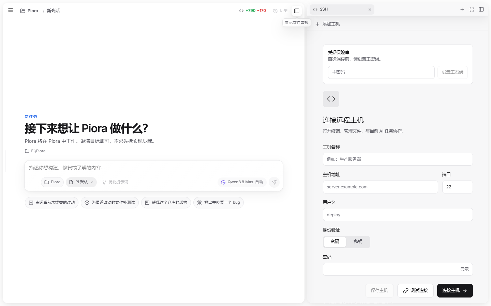
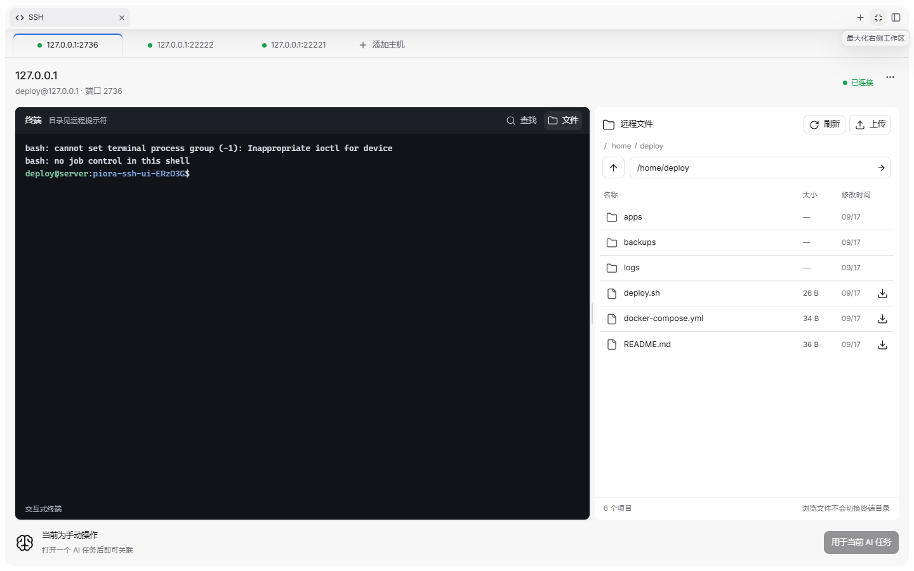

# SSH 远程工作台

SSH 面板沿用工作区的放大入口和项目主题。连接页直接显示表单；已连接时显示主机身份、深色终端和底部 AI 任务关联区。顶部主机标签可以同时保留多条连接，圆点和文字表示连接状态；点击“添加主机”不会关闭现有终端。远程文件默认收起，面板宽度达到 900px 后改为左右布局。窄面板为文件列表保留最小可用空间，分隔线支持拖动和方向键。

## 界面效果

连接表单与“测试连接”：



三台主机同时连接，展开文件后的放大布局：



默认侧栏和窄面板效果：[560px 侧栏](assets/ssh-multihost-560.png) · [320px 窄面板](assets/ssh-multihost-narrow.png)。截图使用本机模拟 SSH/SFTP 服务；截图中的主机与文件均为演示数据。

## 连接与恢复

- “测试连接”使用 `POST /api/ssh/sessions` 的 `testOnly: true`，完成 SSH 认证后关闭临时连接，不注册会话、不打开 shell、不关联任务。
- 正式连接仍使用相同接口，支持密码、私钥和可选解密口令。服务端与浏览器都校验端口 1–65535。
- 浏览器仅在 sessionStorage 保存当前任务最后选中的 SSH 会话 ID，不保存密码、私钥或口令。所有活动连接由服务端的任务级连接列表与事件流同步，切换面板、刷新页面后恢复标签、终端与输出；服务端重启后活动连接需要重新建立。
- 可给主机命名并保存密码、私钥及可选解密口令。桌面端通过 Electron 的系统安全存储加密；系统加密不可用或独立网页运行时，先设置并解锁主密码，再用 scrypt 与 AES-256-GCM 加密。服务端只返回不含凭据的主机元数据，密文单独保存在本机。解锁密钥仅保留在当前服务进程内；忘记主密码无法恢复已有密文。
- 已保存主机支持连接、编辑和删除。地址或端口改变时清除原主机指纹，下一次连接重新确认；已连接的主机不会因为切换标签而重新认证。测试连接只做认证，不创建活动标签。
- 中断后终端保持原有输出；只有用户点击重新连接才重新打开 shell。文件请求不会隐式重连，也不会执行 `cd`。服务器重启后需要重新输入连接信息。
- 终端目录由远程提示符提供。模型命令的完成标记能提供已知 cwd；手动输入后恢复“目录见远程提示符”，避免显示过期路径。

## 文件与任务

- 文件浏览使用 SFTP 的规范绝对路径，支持面包屑、路径输入、上级、刷新、上传、下载。文件夹优先，不给文件夹显示下载按钮。
- 上传显示文件名与真实的上传中、成功、失败状态。失败可重试，无伪造进度百分比，单文件上限 100 MB。
- 任务的已连接主机自动关联到该任务；已有手动连接也可以显式关联或解除关联。同一任务可以关联多台主机，但一条活动连接不能被另一个任务借用。已保存但未连接的主机不会被 Agent 自动连接。
- Agent 使用独立的 ssh 工具先列出本任务活动连接，再以精确会话 ID 指定目标主机执行终端命令、列目录、读写远程文本或传输本地与远程文件。本地 Bash 始终执行本地命令，不再随 SSH 关联而切换执行位置。SSH 工具每次操作都重新核验任务与连接归属；本地文件路径限制在当前任务工作目录，传输上限 100 MB，远程文本上限 2 MB，写入默认不覆盖已有文件。
- 每次 Agent 开始工作时，系统提示给出当前任务的主机清单；如果运行中连接增减或断开，会向该任务注入即时可见的可用性更新，让 Agent 重新调用 ssh sessions。连接状态与命令执行状态独立显示。不同主机可并行执行；同一终端拒绝并发 Agent 命令；关联期间终端输入由 AI 独占，手动输入需先解除关联。“停止命令”关闭该主机的 shell，保留输出并等待显式重连，不影响其他标签。

## 验证入口

```powershell
node node_modules/typescript/bin/tsc --noEmit
npm run lint
node --test lib/ssh-session.test.mjs
node --test lib/ssh-vault.test.mjs
node --test lib/ssh-agent-files.test.mjs
node --test lib/native-terminal-browser.test.mjs
node --test lib/contrast.test.mjs
```

`node scripts/ssh-ui-fixture.mjs` 启动仅监听 127.0.0.1 的真实 SSH/SFTP 测试服务，并打印临时端口和测试凭据。它在系统临时目录创建样例文件；用输出的地址登录开发页面即可验证真实终端和文件传输，不需要远程服务器。退出后清理测试目录。该脚本不随应用自动启动。

界面入口为“工作区 → SSH”。检查浅色与深色主题、300px/560px/1100px 面板，测试成功/认证失败、密码与私钥切换、保险库设置与解锁、主机保存与编辑、多标签切换、搜索、文件路径与长名称、上传结果与重试、下载、断开与重连、刷新恢复，以及任务关联。新任务要先发送首条消息，取得真实任务 ID，才能将新建连接自动关联给 Agent。

## 本轮验收记录（2026-09-17）

| 要求 | 验证结果 |
| --- | --- |
| 连接表单与测试连接 | 密码成功、错误密码反馈及修改后清除旧结果已验证；加密私钥与错误口令通过真实 SSH 服务测试；测试连接不创建 shell 或注册会话。 |
| 终端与连接生命周期 | 输入、搜索高亮、断开保留输出、显式重连和刷新恢复已验证；并发连接、命令互斥及取消后不重放通过自动化测试。 |
| 远程文件 | 导航、长文件名、上传成功、上传失败后重试、下载均使用本地真实 SSH/SFTP 服务验证；文件导航不改变终端目录。 |
| 多主机与 Agent | 本地真实 SSH 服务上建立三条连接，测试连接不占标签；切换标签会切换目标端口和终端。自动化测试覆盖同任务多主机枚举、跨任务拒绝、指定主机执行、单主机停止不影响另一台；未发起真实模型请求。 |
| 凭据与远程文件 | 独立测试目录验证主密码设置/锁定/解锁、密文与元数据分离、主机编辑删除；真实 SFTP 服务验证 Agent 列目录、读写、上传、下载、越界本地路径拒绝。桌面系统加密桥接已通过类型检查，尚未在打包版实机验证。 |
| 布局与主题 | 浏览器中检查了 300px 与 560px 面板，300px 无横向溢出；沿用既有宽屏与明暗主题布局。 |
| 自动化检查 | Web 与桌面 TypeScript 类型检查通过；SSH 会话、保险库和 Agent 文件操作测试通过；定向 ESLint 无错误。 |

截图使用本机临时测试服务，不代表生产服务器或发布包验证。本轮未构建、提交或发布安装包。
